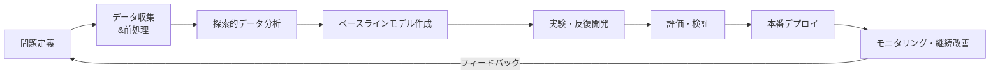

# CNNシステム開発のための継続的・体系的な組織構築ガイド

## 🏢 **第1部：組織構造と役割設計**

### **1.1 マルチディシプリナリーチーム構成**

**コアチーム構成（推奨規模：5-15名）**:
```
1. 機械学習リサーチエンジニア (2-4名)
   - 新規アルゴリズム調査・実装
   - 論文調査・技術動向分析
   
2. MLエンジニア/データエンジニア (3-5名)
   - データパイプライン構築
   - モデル実装・最適化
   - 実験基盤整備
   
3. ソフトウェアエンジニア (2-3名)
   - プロダクションシステム開発
   - API開発・デプロイメント
   
4. データサイエンティスト/ドメイン専門家 (1-2名)
   - ビジネス要件の技術翻訳
   - 評価指標設計
   
5. MLOpsエンジニア (1-2名)
   - CI/CDパイプライン構築
   - モニタリング・運用基盤
   
6. プロダクトマネージャ (1名)
   - ロードマップ管理・優先順位付け
```

### **1.2 明確な役割と責任の定義**

**技術リード/スタッフMLエンジニア**:
- アーキテクチャ決定権限
- 技術的負債の管理
- メンターシップとコードレビュー

**研究と開発の分業モデル**:
```
研究フェーズチーム → 実装フェーズチーム → 本番展開チーム
(探索的開発)      (安定化)          (運用・監視)
    ↓                  ↓                  ↓
PoC作成          リファクタリング     本番デプロイ
ベンチマーク       テスト追加        パフォーマンス監視
```

## 🔄 **第2部：開発プロセスとワークフロー**

### **2.1 標準化された開発ライフサイクル**

**MLプロジェクトフェーズ定義**:



### **2.2 実験管理の体系化**

**ML実験追跡システムの構築**:
```yaml
実験追跡項目:
  - データバージョン: コミットハッシュ/データバージョン
  - コードバージョン: Gitコミットハッシュ
  - ハイパーパラメータ: 完全な設定ファイル
  - 環境情報: Python/PyTorch/TensorFlowバージョン
  - 計算リソース: GPUメモリ・使用時間
  - 評価指標: 訓練/検証/テスト精度
  - 可視化結果: 混同行列・ROC曲線
  - モデルアーティファクト: チェックポイント保存先
```

**実験テンプレートの作成**:
```python
# 標準化された実験スクリプトテンプレート
class CNNExperimentTemplate:
    def __init__(self, config):
        self.config = config
        self.logger = MLFlowLogger()
        self.set_seed(config.seed)
        
    def run_experiment(self):
        # 1. データロード
        dataloaders = self.prepare_data()
        
        # 2. モデル初期化
        model = self.initialize_model()
        
        # 3. 訓練実行（標準化されたループ）
        metrics = self.train_model(model, dataloaders)
        
        # 4. 結果記録
        self.log_results(metrics)
        
        # 5. アーティファクト保存
        self.save_artifacts(model)
```

## 🛠️ **第3部：技術基盤とインフラストラクチャ**

### **3.1 標準化された開発環境**

**Dockerベースの環境統一**:
```dockerfile
# ML開発用Dockerテンプレート
FROM pytorch/pytorch:1.9.0-cuda11.1-cudnn8-runtime

# 共通ライブラリのインストール
RUN pip install \
    mlflow==1.20.2 \
    wandb==0.12.1 \
    tensorboard==2.7.0 \
    pre-commit \
    black==21.12b0 \
    flake8==4.0.1

# プロジェクト固有の設定
COPY requirements.txt /app/
RUN pip install -r /app/requirements.txt

# 共有ボリューム設定
VOLUME ["/app/data", "/app/models", "/app/experiments"]
```

**開発ワークフローの自動化**:
```yaml
# .pre-commit-config.yaml
repos:
  - repo: https://github.com/psf/black
    rev: 21.12b0
    hooks:
      - id: black
        language_version: python3.8
        
  - repo: https://github.com/PyCQA/flake8
    rev: 4.0.1
    hooks:
      - id: flake8
        args: [--max-line-length=88]
```

### **3.2 MLOpsパイプラインの構築**

**継続的トレーニングパイプライン**:
```
1. データバージョン検出
   ↓
2. 自動データ検証
   ↓
3. モデル再訓練トリガー
   ↓
4. ハイパーパラメータ最適化（オプション）
   ↓
5. モデル評価・検証
   ↓
6. モデルレジストリへの登録
   ↓
7. A/Bテスト用カナリアリリース
```

**モデルサービング基盤**:
```python
# 統一推論APIインターフェース
class CNNInferenceService:
    def __init__(self, model_registry):
        self.model_registry = model_registry
        
    def load_model(self, model_name, version):
        # モデルレジストリからのロード
        return self.model_registry.load(model_name, version)
    
    def predict(self, input_data):
        # 前処理 → 推論 → 後処理の統一パイプライン
        preprocessed = self.preprocess(input_data)
        prediction = self.model(preprocessed)
        return self.postprocess(prediction)
    
    def batch_predict(self, input_batch):
        # バッチ処理の最適化実装
        pass
```

## 📚 **第4部：知識管理と継続的学習**

### **4.1 組織的知識ベースの構築**

**技術ドキュメンテーション体系**:
```
knowledge-base/
├── 01_research/
│   ├── paper-reviews/          # 論文レビュー
│   ├── algorithm-comparisons/  # アルゴリズム比較
│   └── state-of-the-art/       # SoTA手法まとめ
├── 02_implementation/
│   ├── code-patterns/          # コーディングパターン
│   ├── performance-optimization/ # 最適化手法
│   └── debugging-guides/       # デバッグガイド
├── 03_infrastructure/
│   ├── mlops-guides/           # MLOpsガイド
│   └── deployment-patterns/    # デプロイパターン
└── 04_domain-knowledge/
    ├── dataset-documentation/  # データセット仕様
    └── evaluation-metrics/     # 評価指標定義
```

### **4.2 継続的学習プログラム**

**定期技術共有会の実施**:
```
月次全体共有会:
  - プロジェクト進捗報告 (各チーム15分)
  - 技術トピック深掘り (30分)
  - Q&Aセッション (15分)

週次チーム読み会:
  - 最新論文レビュー
  - コードレビューセッション
  - ベストプラクティス共有

ハンズオン勉強会 (隔月):
  - 新技術実装ワークショップ
  - ツール導入トレーニング
```

## 📊 **第5部：品質保証とパフォーマンス管理**

### **5.1 モデル品質保証フレームワーク**

**自動化されたモデル検証パイプライン**:
```python
class ModelValidationPipeline:
    def validate_model(self, model, validation_dataset):
        tests = [
            self.test_accuracy_threshold(threshold=0.95),
            self.test_fairness_bias(protected_attributes=['age', 'gender']),
            self.test_robustness(perturbations=['noise', 'blur']),
            self.test_inference_latency(max_latency_ms=100),
            self.test_memory_usage(max_memory_gb=2),
        ]
        
        results = {}
        for test in tests:
            results[test.name] = test.run(model, validation_dataset)
        
        return ModelValidationReport(results)
```

**継続的モニタリングダッシュボード**:
```
モニタリング指標:
1. データ品質モニタリング
   - データドリフト検出
   - 特徴量分布変化
   
2. モデルパフォーマンスモニタリング
   - 予測精度の推移
   - 推論遅延の監視
   
3. ビジネス指標連携
   - ビジネスKPIとの相関分析
   - ROI計算の自動化
```

### **5.2 パフォーマンスベンチマーク標準**

**モデル比較基準の定義**:
```yaml
ベンチマーク指標:
  精度関連:
    - Top-1 Accuracy
    - mAP (物体検出)
    - IoU (セグメンテーション)
    
  効率性関連:
    - 推論時間 (CPU/GPU/モバイル)
    - メモリ使用量
    - モデルサイズ
    - エネルギー消費量
    
  ビジネス関連:
    - 開発コスト
    - 運用コスト
    - スケーラビリティ
```

## 🔄 **第6部：継続的改善と適応戦略**

### **6.1 振り返りと改善プロセス**

**四半期ごとの技術振り返り**:
```markdown
振り返り議題:
1. 技術的成果の評価
   - 目標達成度
   - 技術的進歩
  
2. プロセス改善点の特定
   - ボトルネック分析
   - 効率化の機会
  
3. 技術的負債の管理
   - 負債の定量化
   - 解消計画の策定
  
4. スキルギャップ分析
   - 必要なスキルの特定
   - 教育計画の作成
```

### **6.2 スケーリング戦略**

**チーム成長に伴う組織構造の進化**:
```
フェーズ1: スタートアップ期 (チーム規模: 2-5人)
  - フルスタックMLエンジニア中心
  - 柔軟な役割分担

フェーズ2: 拡大期 (チーム規模: 5-15人)
  - 専門分化の開始
  - プロセス標準化の導入

フェーズ3: 成熟期 (チーム規模: 15人以上)
  - マトリックス組織への移行
  - センターオブエクセレンスの設立
  - キャリアパスの明確化
```

## 🎯 **第7部：成功の測定とKPI設定**

### **7.1 組織的健康度の測定指標**

**チームパフォーマンスKPI**:
```yaml
技術的指標:
  - 実験成功率: 実装→本番展開の成功率
  - 平均実験時間: アイデア→結果までの時間
  - モデル再現性: 実験の再現成功率
  
プロセス指標:
  - コードレビュー応答時間
  - CI/CDパイプライン成功率
  - 本番インシデント対応時間
  
人的指標:
  - 技術スキルの成長率
  - 知識共有の頻度・質
  - チーム満足度スコア
```

**継続的改善サイクルの確立**:
```
1. 測定: KPIの定期的な計測
   ↓
2. 分析: データに基づく根本原因分析
   ↓
3. 改善: 具体的な改善策の実施
   ↓
4. 検証: 改善効果の測定・評価
   ↓
(ループ継続)
```

この体系的な組織構築アプローチにより、CNNシステム開発を単発のプロジェクトから持続可能な組織能力へと進化させることができます。重要なのは、技術的優秀性と組織的プロセスをバランス良く発展させることです。
