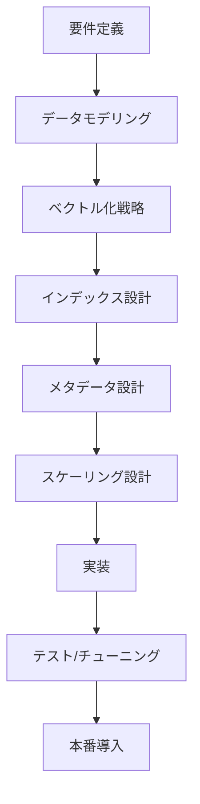

# ◆ ベクトルデータベース開発ガイド

## 1. ベクトルデータベースの基本理解

### 1.1 ベクトルデータベースとは
**高次元ベクトルデータの効率的な保存・検索に特化したデータベース**
- 類似度検索（類似画像、テキスト、音声検索）
- 機械学習モデルの埋め込みベクトルを格納
- 最近傍探索（k-NN, ANN）を高速化

### 1.2 主要なベクトルデータベース
- **Pinecone**: マネージドサービス、使いやすいAPI
- **Weaviate**: グラフ+ベクトル、RESTful/GraphQL API
- **Qdrant**: Rust製、高性能、オープンソース
- **Milvus**: スケーラブル、エンタープライズ向け
- **Chroma**: 軽量、LLMエコシステム向け
- **OpenSearch/Elasticsearch**: k-NNプラグインで対応

## 2. 設計フロー（開発プロセス）

### 2.1 全体設計フロー


### 2.2 詳細ステップ

#### **ステップ1: 要件定義**
```python
# 要件定義チェックリスト
requirements = {
    "データタイプ": "画像/テキスト/音声/マルチモーダル",
    "ベクトル次元数": 128,  # 例: 768 (BERT), 512 (CLIP)
    "データ規模": {
        "初期データ数": "100万件",
        "成長率": "月10%",
        "最大容量": "1億件"
    },
    "パフォーマンス要件": {
        "検索遅延": "100ms以下 @ p95",
        "スループット": "1000 QPS",
        "精度要件": "Recall@10 > 0.95"
    },
    "類似度メトリクス": "コサイン類似度/内積/L2距離",
    "ハイブリッド検索": "メタデータフィルタリング必要か"
}
```

#### **ステップ2: データモデリング**
```python
# ベクトル+メタデータ構造
class VectorRecord:
    def __init__(self):
        self.id = "uuid"  # ユニークID
        self.vector = [0.1, 0.2, ...]  # ベクトルデータ (float32 list)
        self.metadata = {
            "text": "原文テキスト",
            "source": "ファイルパス/URL",
            "category": "分類カテゴリ",
            "timestamp": "2024-01-01T00:00:00Z",
            "embedding_model": "bert-base-ja",
            "embedding_version": "v1.0"
        }
        self.payload = {}  # 追加のアプリケーションデータ
```

## 3. 設計思想（Design Philosophy）

### 3.1 ベクトルファースト思考
- **ベクトル検索を最優先**: 全設計は検索パフォーマンスを中心に
- **メタデータは補助的**: ベクトル検索後のフィルタリング用途

### 3.2 近似最近傍探索（ANN）の採用
```python
# 精度と速度のトレードオフ管理
class ANNTradeoff:
    def __init__(self):
        self.methods = {
            "HNSW": {
                "build_time": "高速",
                "query_time": "超高速",
                "accuracy": "高",
                "memory": "大"
            },
            "IVF": {
                "build_time": "中",
                "query_time": "高速",
                "accuracy": "中〜高",
                "memory": "中"
            },
            "PQ": {
                "build_time": "遅",
                "query_time": "高速",
                "accuracy": "中",
                "memory": "小"
            }
        }
```

### 3.3 スケーラビリティ設計
- **水平スケーリング**: シャーディングによる分散
- **ベクトル圧縮**: 量子化によるメモリ削減
- **階層化ストレージ**: ホット/コールドデータ分離

## 4. データ設計方法

### 4.1 ベクトル次元数設計
```python
def determine_vector_dimension(model_type, use_case):
    """
    モデルタイプとユースケースに基づく次元数決定
    """
    dimension_map = {
        "text_embedding": {
            "bert-base": 768,
            "sentence-bert": 384,
            "multilingual-e5": 1024,
            "text-embedding-ada-002": 1536
        },
        "image_embedding": {
            "clip-vit-b-32": 512,
            "resnet50": 2048,
            "efficientnet-b0": 1280
        },
        "multimodal": {
            "clip": 512,
            "blip": 256
        }
    }
    return dimension_map[model_type][use_case]
```

### 4.2 インデックス設計パターン

#### **パターン1: シングルベクトルインデックス**
```python
# Qdrantの例
from qdrant_client import QdrantClient
from qdrant_client.models import VectorParams, Distance

client = QdrantClient("localhost", port=6333)

client.create_collection(
    collection_name="product_embeddings",
    vectors_config=VectorParams(
        size=768,  # ベクトル次元数
        distance=Distance.COSINE  # 類似度計算方法
    )
)
```

#### **パターン2: マルチベクトルインデックス**
```python
# Milvusの例: 複数ベクトルを同じレコードに
schema = CollectionSchema([
    FieldSchema(name="id", dtype=DataType.INT64, is_primary=True),
    FieldSchema(name="image_vector", dtype=DataType.FLOAT_VECTOR, dim=512),
    FieldSchema(name="text_vector", dtype=DataType.FLOAT_VECTOR, dim=768),
    FieldSchema(name="metadata", dtype=DataType.JSON)
])
```

#### **パターン3: 動的スキーマ**
```python
# Weaviateの例: GraphQLスキーマ
class_obj = {
    "class": "Article",
    "vectorizer": "text2vec-openai",
    "moduleConfig": {
        "text2vec-openai": {
            "model": "ada",
            "modelVersion": "002",
            "type": "text"
        }
    },
    "properties": [{
        "name": "title",
        "dataType": ["text"]
    }]
}
```

### 4.3 メタデータ設計ベストプラクティス
```json
{
  "ベクトルID": "vec_1234567890abcdef",
  "埋め込み情報": {
    "モデル名": "all-MiniLM-L6-v2",
    "モデルバージョン": "v1.2.0",
    "埋め込み日時": "2024-01-01T12:00:00Z",
    "入力テキスト": "ベクトルデータベースの設計方法",
    "入力ハッシュ": "sha256_abcdef..."
  },
  "ビジネスメタデータ": {
    "ドキュメントID": "doc_001",
    "ユーザーID": "user_123",
    "カテゴリ": "技術ドキュメント",
    "重要度": "high",
    "有効期限": "2025-01-01T00:00:00Z"
  },
  "システムメタデータ": {
    "作成日時": "2024-01-01T12:00:00Z",
    "更新日時": "2024-01-02T10:00:00Z",
    "データソース": "api_ingestion_v2",
    "品質スコア": 0.95
  }
}
```

## 5. インデックスアルゴリズム選択

### 5.1 ANNアルゴリズム比較
```python
class ANNAlgorithmSelector:
    def select_algorithm(self, requirements):
        algorithms = {
            "HNSW": {
                "適用条件": {
                    "データサイズ": "小〜中 (1000万件以下)",
                    "メモリ使用量": "多いことを許容",
                    "検索速度優先": True,
                    "更新頻度": "低い"
                },
                "パラメータチューニング": {
                    "M": "16-64 (接続数)",
                    "ef_construction": "100-200",
                    "ef_search": "50-200"
                }
            },
            "IVF": {
                "適用条件": {
                    "データサイズ": "大 (1000万件以上)",
                    "メモリ使用量": "制限あり",
                    "検索速度": "速いが必要",
                    "更新頻度": "中程度"
                },
                "パラメータチューニング": {
                    "nlist": "sqrt(N) ~ N/1000",
                    "nprobe": "10-100"
                }
            },
            "SCANN": {
                "適用条件": {
                    "超大規模データ": "1億件以上",
                    "メモリ制限厳しい": True,
                    "精度許容": "やや低くても可"
                }
            }
        }
        
        # 要件に基づく選択ロジック
        if requirements["data_size"] > 100_000_000:
            return "SCANN"
        elif requirements["memory_constrained"]:
            return "IVF"
        else:
            return "HNSW"
```

### 5.2 量子化手法の選択
```python
def select_quantization_method(dimension, memory_budget, accuracy_target):
    """
    量子化手法の選択ガイド
    """
    quantization_options = {
        "PQ": {  # Product Quantization
            "compression_ratio": "8-32x",
            "accuracy_loss": "中程度",
            "適用次元": "高次元 (>=128)",
            "メモリ使用量": "非常に少ない"
        },
        "SQ": {  # Scalar Quantization
            "compression_ratio": "4x",
            "accuracy_loss": "少ない",
            "適用次元": "任意",
            "メモリ使用量": "少ない"
        },
        "BQ": {  # Binary Quantization
            "compression_ratio": "32x",
            "accuracy_loss": "大きい",
            "適用次元": "任意",
            "メモリ使用量": "非常に少ない"
        }
    }
    
    # 選択ロジック
    if memory_budget < dimension * 4 / 32:  # 非常に厳しいメモリ制約
        return "BQ" if accuracy_target < 0.8 else "PQ"
    elif memory_budget < dimension * 4 / 4:  # 厳しいメモリ制約
        return "PQ"
    else:
        return "SQ"
```

## 6. 実装パターン

### 6.1 埋め込みパイプライン設計
```python
class EmbeddingPipeline:
    def __init__(self):
        self.components = {
            "preprocessor": TextPreprocessor(),
            "embedding_model": SentenceTransformer('all-MiniLM-L6-v2'),
            "normalizer": VectorNormalizer(),
            "quantizer": PQQuantizer(m=8, bits=8),
            "indexer": HNSWIndexer(M=16, ef_construction=200)
        }
    
    async def process_document(self, document):
        """ドキュメントからベクトル化までのパイプライン"""
        # 1. 前処理
        cleaned_text = self.components["preprocessor"].clean(document.text)
        
        # 2. 埋め込み生成
        raw_vector = self.components["embedding_model"].encode(cleaned_text)
        
        # 3. 正規化（コサイン類似度用）
        normalized_vector = self.components["normalizer"].l2_normalize(raw_vector)
        
        # 4. 量子化（オプション）
        quantized_vector = self.components["quantizer"].encode(normalized_vector)
        
        # 5. インデックス登録
        vector_id = self.components["indexer"].add(
            id=document.id,
            vector=quantized_vector,
            metadata=document.metadata
        )
        
        return vector_id
```

### 6.2 検索パイプライン
```python
class VectorSearchPipeline:
    def __init__(self):
        self.stages = [
            "query_embedding",
            "ann_search",
            "re_ranking",
            "metadata_filtering",
            "result_formatting"
        ]
    
    async def hybrid_search(self, query, filters=None, top_k=10):
        """ハイブリッド検索（ベクトル + メタデータ）"""
        results = {}
        
        # ステージ1: クエリのベクトル化
        query_vector = await self.embed_query(query)
        
        # ステージ2: ANN検索
        candidate_ids = await self.ann_search(
            query_vector, 
            limit=top_k * 10  # リランキング用に多めに取得
        )
        
        # ステージ3: 正確な距離計算（リランキング）
        reranked_results = await self.exact_reranking(
            query_vector, 
            candidate_ids
        )
        
        # ステージ4: メタデータフィルタリング
        filtered_results = self.apply_filters(
            reranked_results, 
            filters
        )
        
        # ステージ5: 最終結果整形
        final_results = self.format_results(
            filtered_results[:top_k]
        )
        
        return final_results
```

## 7. スケーリング設計

### 7.1 シャーディング戦略
```python
class VectorShardingStrategy:
    def __init__(self):
        self.strategies = {
            "hash_based": {
                "説明": "ベクトルIDのハッシュで分散",
                "メリット": "均等な分散、シンプル",
                "デメリット": "関連データが分散する可能性"
            },
            "metadata_based": {
                "説明": "メタデータ（ユーザーID、カテゴリ）で分散",
                "メリット": "関連データが同じシャードに",
                "デメリット": "データ偏りの可能性"
            },
            "vector_based": {
                "説明": "ベクトル空間でクラスタリングして分散",
                "メリット": "検索時のネットワーク通信削減",
                "デメリット": "実装が複雑"
            }
        }
    
    def select_sharding(self, access_pattern):
        if access_pattern == "user_specific":
            return "metadata_based"
        elif access_pattern == "global_search":
            return "hash_based"
        else:
            return "vector_based"
```

### 7.2 キャッシュ戦略
```python
class VectorCacheStrategy:
    def __init__(self):
        self.cache_layers = {
            "L1": {  # メモリ内キャッシュ
                "store": "Redis/LRU cache",
                "容量": "1-10GB",
                "内容": "ホットクエリの結果、頻繁アクセスベクトル"
            },
            "L2": {  # SSDキャッシュ
                "store": "ローカルSSD/NVMe",
                "容量": "100GB-1TB",
                "内容": "ウォームベクトル、インデックス部分"
            },
            "L3": {  # オブジェクトストレージ
                "store": "S3/GCS",
                "容量": "無制限",
                "内容": "コールドベクトル、バックアップ"
            }
        }
    
    def design_cache_policy(self, access_pattern):
        return {
            "TTL": {
                "hot_data": "1時間",
                "warm_data": "24時間",
                "cold_data": "7日間"
            },
            "eviction_policy": "LRU + LFU hybrid",
            "prefetch_enabled": True,
            "cache_warming": "定期的な人気クエリ実行"
        }
```

## 8. 監視と運用

### 8.1 キーメトリクス
```python
class VectorDBCriticalMetrics:
    def __init__(self):
        self.metrics = {
            "検索パフォーマンス": {
                "p50_latency": "目標: < 50ms",
                "p95_latency": "目標: < 100ms",
                "p99_latency": "目標: < 200ms",
                "QPS": "現在/最大値監視",
                "エラー率": "< 0.1%"
            },
            "インデックス品質": {
                "recall@k": "k=10で > 0.95",
                "precision@k": "ユースケース依存",
                "NDCG": "ランキング品質指標"
            },
            "システムヘルス": {
                "メモリ使用率": "< 80%",
                "CPU使用率": "< 70%",
                "ディスク使用率": "< 85%",
                "シャード分散": "均一性監視"
            },
            "データ品質": {
                "埋め込み一貫性": "モデルバージョン間の差異",
                "ベクトル次元整合性": "次元数チェック",
                "nullベクトル検出": "異常値監視"
            }
        }
```

### 8.2 アラート設定例
```yaml
# Prometheus + Alertmanager設定例
alerts:
  - alert: HighVectorSearchLatency
    expr: histogram_quantile(0.95, rate(vector_search_duration_seconds_bucket[5m])) > 0.1
    for: 5m
    labels:
      severity: warning
    annotations:
      summary: "ベクトル検索の95パーセンタイル遅延が100msを超えています"
      
  - alert: RecallDegradation
    expr: recall_at_10 < 0.9
    for: 10m
    labels:
      severity: critical
    annotations:
      summary: "検索精度が許容範囲を下回っています"
```

## 9. 注意事項と落とし穴

### 9.1 データ品質の問題
```python
class DataQualityIssues:
    def common_issues(self):
        return {
            "埋め込みの一貫性欠如": {
                "原因": "異なるモデル/パラメータで埋め込み",
                "対策": "埋め込みバージョン管理、再埋め込みパイプライン"
            },
            "次元数の不一致": {
                "原因": "モデル変更時の次元数変更",
                "対策": "スキーマバリデーション、マイグレーションツール"
            },
            "正規化の欠如": {
                "原因": "コサイン類似度用にL2正規化を忘れる",
                "対策": "自動正規化レイヤーの追加"
            },
            "外れ値の影響": {
                "原因": "異常な大きさのベクトル",
                "対策": "ベクトル長のチェック、クリッピング"
            }
        }
```

### 9.2 パフォーマンス最適化のポイント
```python
class PerformanceOptimization:
    def optimization_checklist(self):
        return [
            "✅ バッチ処理による埋め込み生成",
            "✅ ベクトルのメモリアライメント（16/32バイト境界）",
            "✅ SIMD命令の活用（AVX-512など）",
            "✅ GPU利用（大規模推論時）",
            "✅ 適切なインデックスパラメータチューニング",
            "✅ クエリの並列化",
            "✅ 適切なキャッシュサイズ設定",
            "✅ ネットワークレイテンシの最小化"
        ]
```

### 9.3 セキュリティ考慮事項
```python
class SecurityConsiderations:
    def security_measures(self):
        return {
            "データ暗号化": [
                "転送中の暗号化（TLS 1.3）",
                "保存時の暗号化（AES-256）",
                "ベクトルデータの暗号化（準同型暗号の検討）"
            ],
            "アクセス制御": [
                "RBAC（ロールベースアクセス制御）",
                "ベクトルレベルでのアクセス制御",
                "APIキーのローテーション"
            ],
            "監査ログ": [
                "全ての検索クエリのログ",
                "埋め込みモデルの使用記録",
                "データアクセスの監査証跡"
            ],
            "プライバシー保護": [
                "個人情報の埋め込み前マスキング",
                "差分プライバシーの適用検討",
                "データ保持ポリシーの厳格な実施"
            ]
        }
```

## 10. 実装例：商品画像検索システム

### 10.1 システムアーキテクチャ
```python
class ProductImageSearchSystem:
    def __init__(self):
        self.components = {
            "vector_db": QdrantCluster(
                shards=4,
                replicas=2,
                vector_size=512,
                distance="cosine"
            ),
            "embedding_model": CLIPModel(
                vision_model="ViT-B/32",
                text_model="BERT-base"
            ),
            "cache": RedisCluster(
                nodes=3,
                memory_per_node="16GB"
            ),
            "load_balancer": NGINXPlus(
                upstreams=["vector-api-1", "vector-api-2", "vector-api-3"]
            )
        }
    
    async def setup_index(self):
        """インデックス作成と設定"""
        # コレクション作成
        await self.components["vector_db"].create_collection(
            name="product_images",
            vectors_config={
                "image_vector": {"size": 512, "distance": "Cosine"},
                "text_vector": {"size": 768, "distance": "Cosine"}
            },
            optimizers_config={
                "default_segment_number": 5,
                "max_optimization_threads": 4
            },
            hnsw_config={
                "m": 16,
                "ef_construct": 200,
                "full_scan_threshold": 10000
            }
        )
```

## 11. テスト戦略

### 11.1 テストカバレッジ
```python
class VectorDBTestStrategy:
    def test_categories(self):
        return {
            "機能テスト": [
                "単一ベクトル検索",
                "バッチ検索",
                "メタデータフィルタリング",
                "ハイブリッド検索",
                "ページネーション"
            ],
            "精度テスト": [
                "recall@k 測定",
                "precision@k 測定",
                "埋め込み一貫性テスト",
                "モデルバージョン間比較"
            ],
            "パフォーマンステスト": [
                "負荷テスト (100K QPS)",
                "耐久性テスト (72時間連続)",
                "スケーラビリティテスト",
                "フォールトトレランステスト"
            ],
            "統合テスト": [
                "エンドツーエンドパイプライン",
                "データ更新フロー",
                "バックアップ/リストア",
                "マイグレーションシナリオ"
            ]
        }
```

## 12. マイグレーションとバージョン管理

### 12.1 埋め込みモデル変更時の対応
```python
class EmbeddingMigrationPlan:
    def plan_migration(self, old_model, new_model):
        return {
            "フェーズ1: 並行稼働": {
                "期間": "2週間",
                "アクション": [
                    "新モデルで埋め込み生成開始",
                    "新旧両方のインデックスを維持",
                    "A/Bテストで精度比較"
                ]
            },
            "フェーズ2: 移行": {
                "期間": "1ヶ月",
                "アクション": [
                    "新インデックスへのリードレプリカ作成",
                    "トラフィックを徐々に移行",
                    "古いデータの再埋め込み"
                ]
            },
            "フェーズ3: 切り替え": {
                "期間": "1週間",
                "アクション": [
                    "完全に新インデックスに切り替え",
                    "古いインデックスのアーカイブ",
                    "パフォーマンス検証"
                ]
            }
        }
```

## まとめ：成功のためのチェックリスト

### 設計段階
- [ ] 適切なベクトル次元数を選択
- [ ] 適切な類似度メトリクスを選択
- [ ] ANNアルゴリズムを要件に合わせて選択
- [ ] メタデータスキーマを設計

### 実装段階
- [ ] 埋め込みパイプラインの品質管理
- [ ] インデックスパラメータのチューニング
- [ ] キャッシュ戦略の実装
- [ ] 監視メトリクスの設定

### 運用段階
- [ ] 定期的な精度評価
- [ ] パフォーマンスモニタリング
- [ ] 容量計画とスケーリング準備
- [ ] バックアップとディザスタリカバリ

ベクトルデータベースの開発では、従来のデータベース設計とは異なる考え方が必要です。**ベクトル検索のパフォーマンスを最優先**しつつ、**データ品質の維持**と**スケーラビリティの確保**が成功の鍵となります。特に埋め込みモデルの変更管理と、精度と速度のトレードオフのバランスが重要です。

---

## 🌱 AI開発構築参照例(ソースコードを含む)

[マルチLLM対応AIチャットアプリ](https://github.com/8alfalfa8/freeAiChat)

---

