# ◆ AWSにおけるネットワーク設計&構築の概要

AWSにおけるネットワーク設計/構築について、従来のオンプレミス環境とは異なるクラウドネイティブな観点で、要件定義からテスト検証まで詳細に説明します。

---

## **1. 要件定義**

AWSネットワーク設計の出発点であり、ビジネスと技術の要件を明確にします。

### **主要検討項目**
*   **ビジネスドライバ**
    *   コスト最適化 vs パフォーマンス/可用性最優先
    *   コンプライアンス要件 (SOC, PCI DSS, ISO27001など)
    *   リソースの展開範囲 (リージョン、アベイラビリティーゾーン(AZ))
*   **ワークロード特性**
    *   アプリケーションのアーキテクチャ (モノリス vs マイクロサービス)
    *   通信パターン (東西トラフィック vs 南北トラフィック)
    *   想定トラフィック量とスパイクパターン
*   **可用性と耐障害性**
    *   Recovery Time Objective (RTO) / Recovery Point Objective (RPO)
    *   単一AZ障害への耐性 (マルチAZ構成の要否)
    *   リージョン障害への耐性 (マルチリージョン/ディザスタリカバリ構成の要否)
*   **セキュリティとガバナンス**
    *   データ分類とセキュリティレベル
    *   インターネット接続要件 (パブリック/プライベートサブネット)
    *   ハイブリッド接続 (オンプレミス接続) 要件 (AWS Direct Connect, VPN)
    *   監査とログ取得要件 (VPC Flow Log, AWS CloudTrail)
*   **運用と管理**
    *   インフラ as Code (IaC) の適用 (Terraform, AWS CDK)
    *   ネットワーク変更管理プロセス
    *   監視とアラート体制 (Amazon CloudWatch)

---

## **2. 基本設計**

要件を基に、AWSのネットワーク基盤の大枠を設計します。ここでは**VPCを中心**に考えます。

### **VPC設計**
*   **IPアドレス設計 (CIDRブロック)**
    *   将来の拡張性を見据えた十分な大きさのCIDRブロックを選択 (例: `/16`)
    *   オンプレミスや他VPC、将来の接続先との重複を回避
    *   VPCピアリング接続を考慮
*   **サブネット設計**
    *   **パブリックサブネット**: インターネットゲートウェイ(IGW)へのルートを持つ。ELB、NAT Gatewayなどが配置される。
    *   **プライベートサブネット**: インターネットへの直接ルートがない。アプリケーションサーバー、データベースなどが配置される。
    *   **AZごとのサブネット分割**: 高可用性のため、各サブネットを複数AZに跨って作成 (例: `private-subnet-1a`, `private-subnet-1c`)。
*   **ルーティング設計**
    *   ルートテーブルをサブネットごとに設計
    *   パブリックサブネット: `0.0.0.0/0 -> igw-xxxxx`
    *   プライベートサブネット: `0.0.0.0/0 -> nat-xxxxx` (NAT Gateway経由)

### **セキュリティ設計**
*   **セキュリティグループ (SG)**
    *   EC2インスタンスレベルでのステートフルな仮想ファイアウォール
    *   「許可」ポリシーのみ定義 (例: SG for Web: 80/443 from 0.0.0.0/0)
    *   最小権限の原則に基づく設定
*   **ネットワークACL (NACL)**
    *   サブネットレベルでのステートレスなフィルタリング
    *   特定のIPからのアクセス遮断など、追加の防御層として利用

---

## **3. 詳細設計**

基本設計で決まった方針を、具体的なAWSサービスと設定に落とし込みます。

### **L3 (ルーティング) の詳細設計**
*   **インターネット接続**
    *   **インターネットゲートウェイ (IGW)**: VPCとインターネット間の通信を可能にする。
*   **プライベートサブネットのアウトバウンド接続**
    *   **NAT Gateway**: マネージド型のNATサービス。冗長化のため、AZごとに配置し、各AZのプライベートサブネットからは同じAZのNAT Gatewayを参照させる。
*   **ハイブリッド接続 (オンプレミス接続)**
    *   **AWS VPN**: インターネット経由の安全なIPsec接続。サイト間VPN。
    *   **AWS Direct Connect (DX)**: 専用線によるプライベート接続。高帯域幅、低遅延、安定性が要求される場合に採用。
    *   **Transit Gateway**: 多数のVPCやオンプレミスネットワークを中央集権的に接続するハブアンドスポークモデルを構築する際の中核サービス。
*   **VPC間接続**
    *   **VPC Peering**: 異なるVPC間の直接接続。CIDRが重複してはいけない。
    *   **Transit Gateway**: 大規模で複雑なVPC間接続を効率化。

### **L2の考慮点 (AWSでは抽象化)**
*   AWSではハイパーバイザーネットワークがL2を抽象化しているため、物理的なL2スイッチの設定は不要。
*   同一サブネット内の通信はAWSが透過的に処理。
*   **注意点**:  Broadcast/Multicastがサポートされていないため、それらを前提としたレガシーアプリケーションは調整が必要。

### **ファイアウォール (FW) の詳細設計**
*   **ネットワークフィアウォール (NWFW)**
    *   サブネット間やVPC間のトラフィックを詳細に制御できるマネージド型FW。
    *   深パケットインスペクション(DPI)や独自のルールセットで高度な防御が可能。
*   **Gateway Load Balancer (GWLB)**
    *   サードパーティ製FWアプライアンス (Fortinet, Palo Alto等) を透過的に導入するためのサービス。
    *   トラフィックを複数のFWアプライアンスに振り分け、スケーラビリティと冗長性を提供。
*   **WAF (Web Application Firewall)**
    *   Application Load Balancer (ALB) やCloudFrontと連携し、Webアプリケーション層の防御 (SQLインジェクション、XSS等) を担当。

### **ロードバランサー (LB) の詳細設計**
*   **Application Load Balancer (ALB)**
    *   Layer7 (HTTP/HTTPS) での負荷分散。パスベースルーティング (`/api/*` はバックエンドサーバーへ) やホストベースルーティングが可能。
    *   マイクロサービスコンテナアーキテクチャとの親和性が高い。
*   **Network Load Balancer (NLB)**
    *   Layer4 (TCP/UDP) での超低遅延・高パフォーマンスな負荷分散。
    *   固定IPアドレスを保持できるため、IPベースの許可リストが必要な外部システム連携に有効。
    *   GWLBの構成要素としても利用。
*   **Gateway Load Balancer (GWLB)**
    *   上述の通り、サードパーティ製仮想アプライアンスのためのロードバランサー。

---

## **4. 構築・設定**

設計を元に、実際の環境を構築します。**手動でのコンソール操作は非推奨**です。

### **インフラ as Code (IaC) による構築**
*   **Terraform**
    *   マルチクラウドや宣言型の記述を好む場合に強力。
    *   `aws_vpc`, `aws_subnet`, `aws_route_table`, `aws_security_group` などのリソースを定義。
*   **AWS CloudFormation**
    *   AWSネイティブのIaCサービス。AWSリソース間の依存関係の解決に優れる。
    *   CloudFormationテンプレート (YAML/JSON) を作成。
*   **AWS CDK (Cloud Development Kit)**
    *   プログラミング言語 (TypeScript, Python等) でインフラを定義できる。

### **構築手順の例 (Terraformの考え方)**
1.  **VPC & サブネット作成**: VPCと、パブリック/プライベートサブネットを各AZに作成。
2.  **ゲートウェイ設定**: IGW, NAT Gateway (EIPと紐付け) を作成・設定。
3.  **ルートテーブル設定**: パブリック/プライベート用のルートテーブルを作成し、適切なサブネットに関連付け。
4.  **セキュリティグループ作成**: Web, App, DB層ごとにSGを作成し、必要なインバウンド/アウトバウンドルールを定義。
5.  **ロードバランサー構築**: ALB/NLBを作成し、パブリックサブネットに配置。ターゲットグループを作成し、ヘルスチェックを設定。
6.  **その他サービス構築**: 必要に応じて、Transit Gateway, Direct Connect, NWFWなどを構築。

---

## **5. テスト・検証**

構築した環境が設計通りに動作し、要件を満たしているかを確認する重要な工程です。

### **接続性テスト**
*   **内部接続性**: 同一サブネット内、異なるサブネット間の通信を確認。
    *   `ping` (ICMP), `telnet` (TCPポート), `traceroute` コマンドを利用。
*   **インターネット接続性**
    *   パブリックサブネットのEC2からインターネットへのアクセスを確認。
    *   プライベートサブネットのEC2からNAT Gateway経由でのインターネットアクセス (`yum update` 等) を確認。
*   **オンプレミス接続性**: VPN/Direct Connect経由でのオンプレミスからのアクセスを確認。
*   **ロードバランサー経由の接続**: パブリックALBのDNS名にブラウザやcurlでアクセスし、背後にあるEC2に接続できるか確認。

### **フェイルオーバー試験**
*   **AZ障害シミュレーション**: あるAZのEC2インスタンスを停止し、他AZのインスタンスにトラフィックが自動的に流れるか (ALB/ターゲットグループの動作) を確認。
*   **NAT Gateway障害シミュレーション**: プライベートサブネットから、異なるAZのNAT Gatewayを経由するようにルートを変更し、通信が継続するか確認 (設計段階で考慮済みであることが前提)。
*   **インスタンス障害シミュレーション**: ターゲットグループ内のインスタンス1台を停止し、ヘルスチェックで検知され、トラフィックの振り分け対象から外れるかを確認。

### **性能テスト**
*   **負荷テスト**: Apache Bench, JMeter等を用いてALB/NLBに対して負荷をかけ、設計通りの性能・スケーリングが行われるかを確認。
*   **帯域幅テスト**: 大容量ファイルの転送等を行い、NAT GatewayやDirect Connectの帯域幅が期待通りかを確認。

### **セキュリティテスト**
*   **SG/NACLテスト**: 意図的に許可されていないポートやIPからのアクセス試行を行い、通信が遮断されることを確認。
*   **設定監査**: AWS Configやセキュリティハブを利用し、設計から外れた設定 (不適切なS3バケットポリシー、公開されているRDS等) がないかを確認。

この一連のプロセスを通じて、AWSクラウド上に、堅牢でセキュア、かつ高可用性なネットワークインフラを構築・運用することが可能となります。

---
---
# ◆ AWSにおけるハイブリッドネットワーク構成図

以下の図は、オンプレミス環境と接続された、AWS上の代表的なハイブリッドネットワーク構成です。

## ハイブリッドネットワーク構成図全体図

```mermaid
graph TB
    %% ========== 外部ネットワーク ==========
    Internet(("インターネット<br/>Internet"))
    Client["外部クライアント<br/>(インターネットユーザー)"]

    %% ========== オンプレミス環境 ==========
    subgraph OnPremises [オンプレミス環境（Cisco 3階層モデル）]
        direction TB
        
        subgraph OnPrem_Edge [エッジ/セキュリティ層]
            OnPrem_Router["Cisco ルーター<br/>(WAN Edge)"]
            OnPrem_FW["Cisco Firepower<br/>(ファイアウォール)"]
            OnPrem_VPN["Cisco VPN Concentrator"]
        end

        subgraph OnPrem_Core [コア層 Core Layer]
            OnPrem_CoreSw1["Cisco Catalyst 9500<br/>(コアスイッチ)"]
            OnPrem_CoreSw2["Cisco Catalyst 9500<br/>(冗長化)"]
        end

        subgraph OnPrem_Distribution [ディストリビューション層 Distribution Layer]
            OnPrem_Dist_User1["Cisco Catalyst 9300<br/>(ユーザーVLAN GW)"]
            OnPrem_Dist_User2["Cisco Catalyst 9300<br/>(冗長化)"]
            OnPrem_Dist_Server1["Cisco Catalyst 9300<br/>(サーバーVLAN GW)"]
            OnPrem_Dist_Server2["Cisco Catalyst 9300<br/>(冗長化)"]
        end

        subgraph OnPrem_Access [アクセス層 Access Layer]
            OnPrem_Acc_User1["Cisco Catalyst 9200<br/>(ユーザー用)"]
            OnPrem_Acc_User2["Cisco Catalyst 9200<br/>(ユーザー用)"]
            OnPrem_Acc_Server1["Cisco Catalyst 9200<br/>(サーバー用)"]
            OnPrem_Acc_Server2["Cisco Catalyst 9200<br/>(サーバー用)"]
        end

        subgraph OnPrem_Users [ユーザー/端末]
            OnPrem_PC1["PC/Phone"]
            OnPrem_PC2["PC/Phone"]
            OnPrem_Printer["プリンタ"]
        end

        subgraph OnPrem_Servers [オンプレミスサーバー]
            OnPrem_Web["Webサーバー"]
            OnPrem_File["ファイルサーバー"]
            OnPrem_AD["Active Directory<br/>(オンプレミスDC)"]
        end

        %% オンプレミス内部接続
        OnPrem_Router --> OnPrem_FW
        OnPrem_FW --> OnPrem_VPN
        OnPrem_VPN === OnPrem_CoreSw1
        OnPrem_VPN === OnPrem_CoreSw2
        
        OnPrem_CoreSw1 === OnPrem_Dist_User1
        OnPrem_CoreSw1 === OnPrem_Dist_User2
        OnPrem_CoreSw2 === OnPrem_Dist_User1
        OnPrem_CoreSw2 === OnPrem_Dist_User2
        
        OnPrem_CoreSw1 === OnPrem_Dist_Server1
        OnPrem_CoreSw1 === OnPrem_Dist_Server2
        OnPrem_CoreSw2 === OnPrem_Dist_Server1
        OnPrem_CoreSw2 === OnPrem_Dist_Server2
        
        OnPrem_Dist_User1 --- OnPrem_Acc_User1
        OnPrem_Dist_User1 --- OnPrem_Acc_User2
        OnPrem_Dist_User2 --- OnPrem_Acc_User1
        OnPrem_Dist_User2 --- OnPrem_Acc_User2
        
        OnPrem_Dist_Server1 --- OnPrem_Acc_Server1
        OnPrem_Dist_Server1 --- OnPrem_Acc_Server2
        OnPrem_Dist_Server2 --- OnPrem_Acc_Server1
        OnPrem_Dist_Server2 --- OnPrem_Acc_Server2
        
        OnPrem_Acc_User1 --- OnPrem_PC1
        OnPrem_Acc_User2 --- OnPrem_PC2
        OnPrem_Acc_User2 --- OnPrem_Printer
        
        OnPrem_Acc_Server1 --- OnPrem_Web
        OnPrem_Acc_Server2 --- OnPrem_File
        OnPrem_Acc_Server2 --- OnPrem_AD
    end

    %% ========== AWSクラウド環境 ==========
    subgraph AWS [AWSクラウド環境]
        direction TB
        
        subgraph AWS_Edge [エッジ層（オンプレミス接続）]
            AWS_VPN["AWS Site-to-Site VPN"]
            AWS_DX["AWS Direct Connect"]
            AWS_IGW["インターネットゲートウェイ"]
        end

        subgraph AWS_Security [セキュリティ層 ★インバウンド検査]
            direction LR
            AWS_WAF["AWS WAF<br/>(WebアプリケーションFW)"]
            AWS_GWLB["Gateway Load Balancer<br/>(トラフィック転送)"]
            AWS_NFW["AWS Network Firewall<br/>/ サードパーティーFW"]
            
            AWS_WAF == "4. WAF通過後、<br/>GWLBへ転送" ==> AWS_GWLB
            AWS_GWLB == "5. ファイアウォールで<br/>詳細検査" ==> AWS_NFW
        end

        subgraph AWS_Core [コア統合層]
            AWS_TGW["AWS Transit Gateway<br/>(クラウドコア)"]
        end

        %% ★★★ 修正ポイント：VPC Web/AP層の詳細なサブネット構造 ★★★
        subgraph AWS_VPC_Web [VPC: Web/AP層 10.0.0.0/16]
            direction TB
            
            subgraph AZ1 ["アベイラビリティーゾーン A (ap-northeast-1a)"]
                PubSubnet_AZ1["パブリックサブネット<br/>10.0.1.0/24<br/>• インターネットGW経路"]
                PrivSubnet_Web_AZ1["プライベートサブネット<br/>10.0.10.0/24<br/>• Web/APサーバー"]
                PrivSubnet_App_AZ1["プライベートサブネット<br/>10.0.20.0/24<br/>• アプリケーションサーバー"]
                
                NAT_GW_AZ1["NAT Gateway<br/>(AZ1)"]
                Web_EC2_AZ1["Webサーバー<br/>(EC2)"]
                App_EC2_AZ1["APサーバー<br/>(EC2)"]
                
                PubSubnet_AZ1 --- NAT_GW_AZ1
                NAT_GW_AZ1 == "インターネットアクセス" ==> PrivSubnet_Web_AZ1
                PrivSubnet_Web_AZ1 --- Web_EC2_AZ1
                PrivSubnet_App_AZ1 --- App_EC2_AZ1
            end
            
            subgraph AZ2 ["アベイラビリティーゾーン C (ap-northeast-1c)"]
                PubSubnet_AZ2["パブリックサブネット<br/>10.0.2.0/24<br/>• インターネットGW経路"]
                PrivSubnet_Web_AZ2["プライベートサブネット<br/>10.0.11.0/24<br/>• Web/APサーバー"]
                PrivSubnet_App_AZ2["プライベートサブネット<br/>10.0.21.0/24<br/>• アプリケーションサーバー"]
                
                NAT_GW_AZ2["NAT Gateway<br/>(AZ2)"]
                Web_EC2_AZ2["Webサーバー<br/>(EC2)"]
                App_EC2_AZ2["APサーバー<br/>(EC2)"]
                
                PubSubnet_AZ2 --- NAT_GW_AZ2
                NAT_GW_AZ2 == "インターネットアクセス" ==> PrivSubnet_Web_AZ2
                PrivSubnet_Web_AZ2 --- Web_EC2_AZ2
                PrivSubnet_App_AZ2 --- App_EC2_AZ2
            end
            
            %% クロスAZの負荷分散
            AWS_ALB["Application Load Balancer<br/>(internet-facing)<br/>+ WAF統合"]
            
            AWS_ALB == "トラフィック分散" ==> Web_EC2_AZ1
            AWS_ALB == "トラフィック分散" ==> Web_EC2_AZ2
            
            Web_EC2_AZ1 == "アプリケーション通信" ==> App_EC2_AZ1
            Web_EC2_AZ2 == "アプリケーション通信" ==> App_EC2_AZ2
            
            %% セキュリティグループ（論理的な制御）
            SG_Web_LB["SG_ALB: Web用<br/>80/443許可"]
            SG_Web_EC2["SG_WebEC2: <br/>ALBからのみ許可"]
            SG_App_EC2["SG_AppEC2: <br/>WebEC2からのみ許可"]
            
            SG_Web_LB -.-> AWS_ALB
            SG_Web_EC2 -.-> Web_EC2_AZ1
            SG_Web_EC2 -.-> Web_EC2_AZ2
            SG_App_EC2 -.-> App_EC2_AZ1
            SG_App_EC2 -.-> App_EC2_AZ2
        end

        subgraph AWS_VPC_DB [VPC: データベース層 10.1.0.0/16]
            direction TB
            
            subgraph DB_AZ1 [アベイラビリティーゾーン A]
                DB_Subnet_AZ1["DBプライベートサブネット<br/>10.1.1.0/24"]
                RDS_Primary["RDS (Primary)<br/>MySQL/PostgreSQL"]
                DB_Subnet_AZ1 --- RDS_Primary
            end
            
            subgraph DB_AZ2 [アベイラビリティーゾーン C]
                DB_Subnet_AZ2["DBプライベートサブネット<br/>10.1.2.0/24"]
                RDS_Standby["RDS (Standby)<br/>レプリカ"]
                DB_Subnet_AZ2 --- RDS_Standby
            end
            
            SG_DB["SG_DB: <br/>AppEC2からのみ許可"]
            SG_DB -.-> RDS_Primary
            SG_DB -.-> RDS_Standby
            
            %% AppサーバーからDBへの接続
            App_EC2_AZ1 == "SQL接続" ==> RDS_Primary
            App_EC2_AZ2 == "SQL接続" ==> RDS_Primary
        end

        subgraph AWS_VPC_Shared [VPC: 共有サービス 10.2.0.0/16]
            direction TB
            Shared_Subnet1["共有サービスサブネット<br/>10.2.1.0/24"]
            Shared_Subnet2["共有サービスサブネット<br/>10.2.2.0/24"]
            
            AWS_AD["AWS Managed Microsoft AD"]
            AWS_Bastion["踏み台サーバー<br/>(Bastion/Jump Server)"]
            
            Shared_Subnet1 --- AWS_AD
            Shared_Subnet2 --- AWS_Bastion
            
            SG_Shared["SG_Shared: <br/>管理アクセス制御"]
            SG_Shared -.-> AWS_AD
            SG_Shared -.-> AWS_Bastion
        end
    end

    %% ========== 接続関係 ==========
    
    %% 1. インターネットからのアクセス
    Client == "1. HTTPSリクエスト" ==> Internet
    Internet == "2. インターネットGW" ==> AWS_IGW
    AWS_IGW == "3. WAFでWeb攻撃防御" ==> AWS_WAF
    AWS_NFW == "6. 検査通過後の<br/>許可トラフィック" ==> AWS_TGW
    
    %% 2. クラウド内部ルーティング
    AWS_TGW == "7. Web VPCのALBへ" ==> AWS_ALB
    
    %% 3. オンプレミス接続
    OnPrem_CoreSw1 === AWS_VPN
    OnPrem_CoreSw2 === AWS_VPN
    OnPrem_CoreSw1 === AWS_DX
    OnPrem_CoreSw2 === AWS_DX
    
    AWS_VPN === AWS_TGW
    AWS_DX === AWS_TGW
    
    %% 4. 共有サービスVPCとの接続
    AWS_TGW == "10a. 認証/管理トラフィック" ==> AWS_VPC_Shared
    AWS_VPC_Shared == "10b. レスポンス" ==> AWS_TGW
    
    %% 5. 管理アクセス（踏み台経由）
    OnPrem_PC1 == "SSH/RDP" ==> OnPrem_CoreSw1
    OnPrem_CoreSw1 == "VPN/DX" ==> AWS_VPC_Shared
    AWS_VPC_Shared --> AWS_Bastion
    AWS_Bastion == "内部管理" ==> Web_EC2_AZ1
    AWS_Bastion == "内部管理" ==> Web_EC2_AZ2
    AWS_Bastion == "内部管理" ==> App_EC2_AZ1
    AWS_Bastion == "内部管理" ==> App_EC2_AZ2

    %% ========== スタイル定義 ==========
    classDef internet fill:#f9f,stroke:#333,stroke-width:2px
    classDef onprem_edge fill:#ff9900,stroke:#333,stroke-width:2px
    classDef onprem_core fill:#ff4d4d,stroke:#333,stroke-width:2px,color:white
    classDef onprem_dist fill:#4da6ff,stroke:#333,stroke-width:2px
    classDef onprem_access fill:#9fdf9f,stroke:#333,stroke-width:1px
    classDef onprem_server fill:#d98cb3,stroke:#333,stroke-width:1px
    
    classDef aws_edge fill:#ff9900,stroke:#333,stroke-width:2px
    classDef aws_security fill:#ff4444,stroke:#333,stroke-width:3px,color:white
    classDef aws_core fill:#4da6ff,stroke:#333,stroke-width:2px
    classDef aws_vpc fill:#d98cb3,stroke:#333,stroke-width:1px
    classDef aws_shared fill:#ff6b6b,stroke:#333,stroke-width:2px,color:white
    classDef subnet fill:#e1f5fe,stroke:#333,stroke-width:1px
    classDef sg fill:#fff9c4,stroke:#333,stroke-width:1px,stroke-dasharray: 5 5
    
    class Internet,Client,OnPrem_Router internet
    class OnPrem_FW,OnPrem_VPN onprem_edge
    class OnPrem_CoreSw1,OnPrem_CoreSw2 onprem_core
    class OnPrem_Dist_User1,OnPrem_Dist_User2,OnPrem_Dist_Server1,OnPrem_Dist_Server2 onprem_dist
    class OnPrem_Acc_User1,OnPrem_Acc_User2,OnPrem_Acc_Server1,OnPrem_Acc_Server2 onprem_access
    class OnPrem_Web,OnPrem_File,OnPrem_AD onprem_server
    
    class AWS_VPN,AWS_DX,AWS_IGW aws_edge
    class AWS_WAF,AWS_GWLB,AWS_NFW aws_security
    class AWS_TGW aws_core
    class AWS_VPC_Web,AWS_VPC_DB,AWS_VPC_Shared aws_vpc
    class PubSubnet_AZ1,PubSubnet_AZ2,PrivSubnet_Web_AZ1,PrivSubnet_Web_AZ2,PrivSubnet_App_AZ1,PrivSubnet_App_AZ2,DB_Subnet_AZ1,DB_Subnet_AZ2,Shared_Subnet1,Shared_Subnet2 subnet
    class SG_Web_LB,SG_Web_EC2,SG_App_EC2,SG_DB,SG_Shared sg
```

## VPC Web/AP層の詳細解説

### 1. サブネット設計（Ciscoのアクセス層に相当）

| サブネット種別 | CIDR | 役割 | ルーティング |
|:---|:---|:---|:---|
| **パブリックサブネット** | 10.0.1.0/24 (AZ1) 10.0.2.0/24 (AZ2) | • インターネットGWへの経路を持つ • ALB、NAT Gatewayを配置 | インターネットGWへの経路あり |
| **プライベートサブネット (Web)** | 10.0.10.0/24 (AZ1) 10.0.11.0/24 (AZ2) | • Webサーバー（EC2）を配置 • インターネットから直接アクセス不可 | NAT Gateway経由でインターネットアクセス |
| **プライベートサブネット (AP)** | 10.0.20.0/24 (AZ1) 10.0.21.0/24 (AZ2) | • アプリケーションサーバーを配置 • Web層からのみアクセス可能 | NAT Gateway経由でインターネットアクセス |

### 2. マルチAZ構成による高可用性

- **AZ1（ap-northeast-1a）** と **AZ2（ap-northeast-1c）** の2つのアベイラビリティーゾーンに分散
- 片方のAZがダウンしても、もう一方のAZでサービス継続可能
- **ALB** が自動的に正常なAZのサーバーにトラフィックを振り分け

### 3. セキュリティグループによる多層防御

| セキュリティグループ | 適用先 | 許可ルール |
|:---|:---|:---|
| **SG_ALB** | Application Load Balancer | インターネットからの80/443を許可 |
| **SG_WebEC2** | Webサーバー | ALBからのトラフィックのみ許可 |
| **SG_AppEC2** | APサーバー | Webサーバーからのトラフィックのみ許可 |
| **SG_DB** | RDS | APサーバーからのSQLポートのみ許可 |

### 4. NAT Gatewayの役割

- プライベートサブネットのサーバーがインターネットにアクセスするための経路
- ソフトウェアアップデート、外部API呼び出しなどに使用
- **AZごとに配置**することで、AZ障害時の影響を局所化

## Cisco 3階層モデルとの対応

| Cisco 3階層 | AWS VPC Web/AP層での相当機能 |
|:---|:---|
| **アクセス層** | プライベートサブネット内のEC2インスタンス |
| **ディストリビューション層** | サブネット間ルーティング、セキュリティグループ |
| **コア層（集約）** | ALB（ロードバランサー）、Transit Gateway接続 |

これにより、**Ciscoの階層モデルの考え方をクラウド上で完全に再現**しつつ、AWSの持つ**スケーラビリティと高可用性**を活かした構成となっています。
