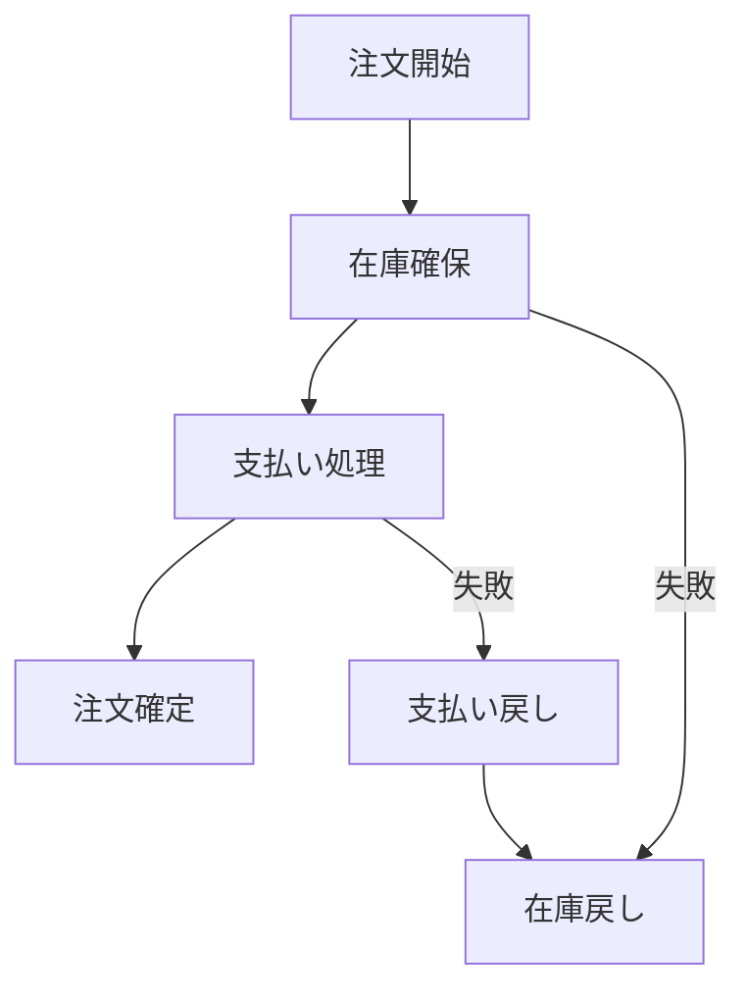

# ◆ マイクロサービス間のセッション・メモリ共有：設計観点からの詳細分析

## 1. 基本設計哲学とアーキテクチャ原則

### 1.1 ステートレス設計の原則
- **サービス自体は状態を持たない**ことが理想
- 状態が必要な場合は外部ストアに分離
- スケーラビリティと耐障害性の向上

### 1.2 分散システムのCAP定理への対応
- **一貫性 (Consistency)** vs **可用性 (Availability)** vs **分断耐性 (Partition Tolerance)**
- ユースケースに応じたトレードオフの選択
- セッションデータ：APシステム（可用性優先）
- 決済データ：CPシステム（一貫性優先）

## 2. サービス連携パターンの設計分類

### 2.1 並行処理パターン（同時実行）
```
ユーザーリクエスト
    ├─ サービスA (独立処理)
    ├─ サービスB (独立処理) 
    └─ サービスC (独立処理)
```
**設計特性**:
- サービス間の依存関係が少ない
- 結果の集約が必要
- データ競合の可能性低い

### 2.2 連鎖処理パターン（前後連携）
```
ユーザーリクエスト
    → サービスA → サービスB → サービスC → レスポンス
```
**設計特性**:
- サービス間の強い依存関係
- 処理の順序性が重要
- エラー伝播の考慮が必要

### 2.3 混合パターン
```
ユーザーリクエスト
    → サービスA
        ├─ サービスB (並列)
        ├─ サービスC (並列)
        └─ サービスD (直列)
    → サービスE → レスポンス
```

## 3. データ共有・同期の設計アプローチ

### 3.1 共有ストアパターン
```
[サービスA] → [共有キャッシュ/DB] ← [サービスB]
```
**設計上の考慮点**:
- データモデルの設計（全サービスで共通利用可能な構造）
- アクセスパターンの最適化（Read/Write比率）
- コヒーレンシーポリシー（一貫性レベル）

### 3.2 イベント駆動パターン
```
[サービスA] → [イベント発行] → [イベントバス] → [サービスB, C...]
```
**設計上の考慮点**:
- イベントスキーマの設計（拡張性、後方互換性）
- メッセージ順序性の保証
- 重複処理/ロストメッセージへの耐性

### 3.3 API合成パターン
```
[API Gateway] → [サービスA → サービスB → サービスC]
```
**設計上の考慮点**:
- タイムアウトと回路的遮断（Circuit Breaker）
- 部分失敗への対応策
- リトライポリシー

## 4. セッション管理の設計パターン

### 4.1 クライアントサイドセッション
```
クライアント → [署名付きトークン(JWT)] → 各サービス
```
**設計特性**:
- サービス間でセッション状態を共有しない
- スケーラビリティ高い
- トークン失効の管理が課題

### 4.2 サーバーサイドセッションストア
```
クライアント → [セッションID] → [API Gateway] → [共有セッションストア]
    ↓
各サービスはセッションストアから状態取得
```
**設計特性**:
- セッション状態の集中管理
- セッションサイズの制御が必要
- ネットワークレイテンシの影響

## 5. データ一貫性モデルの設計

### 5.1 強一貫性モデル
**適用ケース**:
- 金融取引、在庫管理
- 設計上のトレードオフ: レイテンシ↑、可用性↓

### 5.2 最終一貫性モデル  
**適用ケース**:
- ユーザープロファイル、レコメンデーション
- 設計上のトレードオフ: レイテンシ↓、複雑性↑

### 5.3 セッション一貫性モデル
**適用ケース**:
- ユーザーセッション、ショッピングカート
- 設計上のトレードオフ: ユーザー体験重視

## 6. 境界づけられたコンテキストとデータ所有権

### 6.1 データ所有権の原則
```
ユーザーサービス: ユーザープロファイル情報 ← 所有
注文サービス: 注文情報 + ユーザー参照ID ← 参照のみ
```
**設計指針**:
- 各サービスが自身のデータを排他的に管理
- 他サービスのデータは参照のみ
- データの重複は許容（参照情報のみ）

### 6.2 コンテキストマッピング
- **共有カーネル**: 共通ドメインモデルの共有
- **顧客/供給者**: 明確なインターフェース契約
- **分離された方法**: 完全な独立性維持

## 7. トランザクション境界と Saga パターン

### 7.1 Sagaの設計選択


**設計上の考慮点**:
- 補償トランザクションの設計
- Sagaの協調型 vs 編成型
- 冪等性の確保

## 8. 非機能要件に基づく設計選択

### 8.1 パフォーマンス要件別設計
- **低レイテンシ**: インメモリキャッシュ、クライアントサイドセッション
- **高スループット**: 非同期処理、イベント駆動
- **高可用性**: レプリケーション、フォールバック

### 8.2 セキュリティ要件別設計
- **データ秘匿性**: エンドツーエンド暗号化、トークンベース認証
- **監査証跡**: イベントソーシング、不変ログ
- **コンプライアンス**: データ所在地制御、保存期間管理

## 9. モニタリングと観測可能性の設計

### 9.1 分散トレーシングの設計
- **相関ID**: リクエストチェーン全体の追跡
- **コンテキスト伝播**: サービス間でのトレース情報伝達
- **パフォーマンス分析**: ボトルネック特定のためのメトリクス

### 9.2 ヘルスチェックとサービスディスカバリ
- サービス可用性の監視
- 自動的な故障検出と回復
- 負荷分散の最適化

## 10. 設計判断フレームワーク

### 10.1 設計選択の決定要因
1. **データ更新頻度**: 高頻度 → イベント駆動、低頻度 → API合成
2. **一貫性要件**: 強要件 → Sagaパターン、弱要件 → 最終一貫性  
3. **スケール特性**: 高スケール → ステートレス、低スケール → ステートフル
4. **チーム構造**: 独立チーム → 疎結合、単一チーム → 密結合

### 10.2 アンチパターンと回避策
- **分散されたモノリス**: 明確な境界づけられたコンテキストの定義
- **ネットワークの過信**: タイムアウト、リトライ、サーキットブレーカーの実装
- **共有データベース**: サービスごとのデータ所有権の確立

この設計観点に基づいて、具体的な技術実装を選択することが、成功するマイクロサービスアーキテクチャの鍵となります。
