# 運用設計書(オブザーバビリティの3本柱版)

運用設計書の全体構造を視覚化してから、詳細を説明します。

各章をクリックすると詳細説明が表示されます。以下、全13章を順に詳しく解説します。

---

## 第1章　文書概要・目的・適用範囲

この章は設計書全体の「契約書」に相当します。記載すべき内容は、文書の目的（例：「本設計書はXシステムにおいてMetrics・Logs・Tracesを統合した運用監視基盤の設計方針を定めるものである」）、適用対象サービスおよびシステム境界、読者対象（SRE、開発チーム、運用チーム）、そして改訂管理ルールです。曖昧な適用範囲は後工程での責任の押しつけ合いを生むため、境界を明確に記述することが重要です。

---

## 第2章　システム構成概要

監視対象となるシステム全体のアーキテクチャを示します。サービスマップ（どのマイクロサービスが何に依存しているか）、インフラ構成（Kubernetes、クラウドリージョン、ネットワーク境界）、そして各コンポーネントが生成するテレメトリの種類と量の概算を記載します。この章が不正確だと、後続の収集設計に漏れが生じます。

---

## 第3章　オブザーバビリティ設計方針

3本柱をどのような思想で組み合わせるかを定義する章です。具体的には「OpenTelemetryを計装の標準とし、TraceIDをキーにMetrics・Logs・Tracesを相関させる」「全データは単一のObservabilityプラットフォームに集約する」といった基本方針を明文化します。またコスト管理方針（データ量上限、サンプリング率の基準）と、将来の拡張に備えたベンダー非依存性の方針もここで決めます。

---

## 第4章　Metrics設計

収集・可視化・アラートの3層で設計を記述します。

収集設計では「何を、どの粒度で、どのラベルで収集するか」を定義します。例えば「HTTPリクエストはサービス名・エンドポイント・ステータスコードのラベルで15秒粒度で収集」のように具体化します。保存設計では生データは30日、ダウンサンプリング済みデータは1年といった保存ポリシーを定めます。ダッシュボード設計ではGolden Signals（レイテンシ・トラフィック・エラー率・飽和度）を中心に、ビジネスKPIとの対応関係も整理します。アラート設計では閾値の根拠を数値で示し、アラートファティーグ（警報過多）を防ぐためのルールも合わせて定義します。

---

## 第5章　Logs設計

ログは量が多い分、設計が甘いとコストとノイズが爆発します。ログレベル（DEBUG/INFO/WARN/ERROR/FATAL）の定義と使い分けルール、構造化ログのJSONスキーマ（必須フィールドとして`timestamp`・`service`・`trace_id`・`level`・`message`を定める等）、収集・転送パイプライン（FluentdやFluentBitの設定方針）を記載します。検索設計では「障害発生から根本原因ログ到達まで3分以内」のような目標を設定し、それを達成するためのインデックス設計とクエリパターンを記述します。

---

## 第6章　Traces設計

マイクロサービス環境の「透明性」を担保する核心章です。計装方針として、OpenTelemetry SDKによる自動計装と手動計装（重要なビジネストランザクション）の境界を定義します。サンプリング戦略は特に重要で、全件収集はコストが高すぎるため「エラー発生時は100%、正常時は1%のHead-based Sampling」または「Tail-based Sampling（処理完了後に遅延リクエストを優先収集）」を採用するかを明記します。TraceID伝搬設計では、HTTPヘッダー（`traceparent`）やメッセージキューのメタデータを通じて、サービス境界をまたいだコンテキスト伝搬の実装方法を規定します。

---

## 第7章　相関連携設計（Correlation）

3本柱を「点」から「面」にする最重要章です。TraceIDを共通キーとして、Metricsのスパイク発生時刻→該当TraceID→関連ログを自動的に紐づける仕組みを設計します。具体的には「Grafana上でエラー率グラフの異常点をクリックすると、同じTraceIDを持つJaegerのトレースとLokiのログに遷移できる」ような連携フローを図示します。ContextPropagation（コンテキスト伝搬）の実装規約と、相関クエリのサンプルもここに記載します。

---

## 第8章　アラート・エスカレーション設計

アラートの定義だけでなく「誰がいつどう動くか」まで記述します。重要度をP1（即時対応、サービス停止）・P2（15分以内、機能劣化）・P3（翌営業日、性能低下）・P4（計画的対応）の4段階に分類し、それぞれの通知チャネル（PagerDuty・Slack・メール）と応答時間SLAを定めます。オンコールローテーションの設計（週次交代、二次オンコールのエスカレーション条件）もここで明文化します。アラートファティーグ防止のため、アラートの棚卸しサイクル（月次レビュー等）も規定します。

---

## 第9章　インシデント対応手順

障害発生時に誰もが同じ手順で動けるよう、フローを明文化します。検知（アラート発報）→トリアージ（影響範囲の特定、Metricsで規模把握）→調査（Tracesでボトルネック特定、Logsで根本原因確認）→対処→恒久対策というフローを図示します。Runbook（対処手順書）の書き方テンプレートと、ポストモーテム（事後分析）のフォーマット（Timeline・根本原因・再発防止策・アクションアイテム）を添付します。「blame-free」文化の推進も設計書に明記することが現代的なSRE実践として重要です。

---

## 第10章　SLO / SLA 管理設計

可観測性データをビジネス価値に結びつける章です。SLI（サービスレベル指標、例：成功リクエスト率）、SLO（目標値、例：99.9%/月）、エラーバジェット（許容できる失敗量）を定義します。エラーバジェットの消費速度（Burn Rate）をMetricsで常時監視し、消費が速い場合はアラートを発報する設計も記述します。SLAは顧客との契約値であり、SLOはそれより厳しい社内目標値として区別して定義することがベストプラクティスです。

---

## 第11章　キャパシティ管理・変更管理

Metricsの時系列傾向を使ったキャパシティ計画を記述します。CPU・メモリ・ディスク・ネットワーク帯域のリソース使用率トレンドから、スケールアウトが必要なタイミングを予測するモデルを定義します。変更管理との連携として「デプロイ前後のMetrics比較」「変更タイムラインのダッシュボードへのアノテーション付与」を義務化することで、変更起因の障害を迅速に識別できる仕組みを設計します。

---

## 第12章　セキュリティ・監査ログ設計

運用監視基盤自体のセキュリティを担保する章です。監査ログ（誰がいつ何の設定を変更したか、アラートを誰がミュートしたか等）の設計と改ざん防止策、観測データへのアクセス制御（個人情報を含むログへのマスキング処理）、保存データの暗号化方針を記述します。GDPR・個人情報保護法等のコンプライアンス要件に対応したログ保存期間と削除手順も明記します。

---

## 第13章　付録・運用チェックリスト

設計書の参照性を高める補足資料を集約します。採用ツールの一覧と選定理由、OpenTelemetry等の主要設定ファイルのサンプル、日次・週次・月次の運用チェックリスト、用語集（Span・TraceID・エラーバジェット等）、そして設計書自体の改訂履歴を収録します。チェックリストは「アラートの棚卸しを月次で実施したか」「SLOの達成状況を週次でレビューしたか」のような形で、運用品質を継続的に維持するための実務的なツールとして機能します。

---

## 設計書全体を通じた重要原則

3本柱を統合した運用設計書で特に重要なのは、「設計書が実際の運用と乖離しないこと」です。アーキテクチャが変わればMetricsの収集対象が変わり、新サービスが追加されればTraceの伝搬設計が変わります。そのため設計書のライフサイクル管理（変更トリガー・承認プロセス・定期レビュー周期）を第1章に明記し、設計書を「生きたドキュメント」として維持する仕組みそのものを設計書に組み込むことが、大規模システムの運用品質を長期的に保つ鍵となります。

