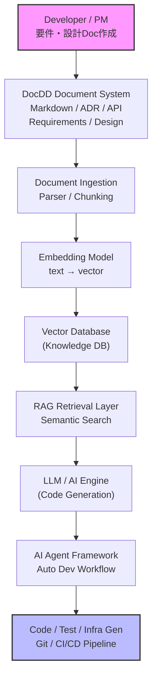

# ◆ AIDD × DocDD × RAG 開発方式概要

**AIDD × DocDD × RAG** は、現在のエンタープライズAI開発で非常に重要なアーキテクチャです。  
簡単に言うと次の構造になります。

```
DocDD（ドキュメント中心開発）
        ↓
RAG（企業知識検索）
        ↓
AIDD（AI自動開発）
```

つまり

**「ドキュメントを知識としてAIが理解し、AIが開発を行うシステム」**

です。

以下では **システム構成図 → コンポーネント → データフロー → 実装例** まで詳細に説明します。

---

## 1. AIDD × DocDD × RAG 全体システム構成

### 全体アーキテクチャ


---

## 2. 各レイヤー詳細

このアーキテクチャは **6つのレイヤー**で構成されます。

```
① Document Layer
② Knowledge Layer
③ Retrieval Layer
④ AI Generation Layer
⑤ Agent Layer
⑥ DevOps Layer
```

---

## 3. Document Layer（DocDD）

DocDDでは

**ドキュメントがシステムの真実**

になります。

```
Docs = System Source
```

DocDDでは、コードより先にドキュメントを作成します。
そのドキュメントをAIが読み取り、コードやテストを生成します。 ([ドキュメント駆動開発][1])

---

### DocDDドキュメント構成

例

```
docs/
 ├ requirements.md
 ├ architecture.md
 ├ api-spec.yaml
 ├ database-design.md
 ├ security-policy.md
 └ operations.md
```

---

### ドキュメント例

#### requirements.md

```
System: Customer Support AI

Feature:
- ticket classification
- automatic response
- knowledge search
```

---

#### architecture.md

```
Architecture:
- Frontend: React
- Backend: FastAPI
- DB: PostgreSQL
- AI: RAG
```

---

## 4. Knowledge Layer（RAG Knowledge Base）

調査中

---

## 5. Retrieval Layer（検索）

調査中

---

## 6. AI Generation Layer（LLM）

調査中

---

## 7. AI Agent Layer（AIDD）

調査中

---

## 8. DevOps Layer

調査中

---

## 9. データフロー（重要）

調査中

---

## 10. 実際の技術スタック

調査中

---


