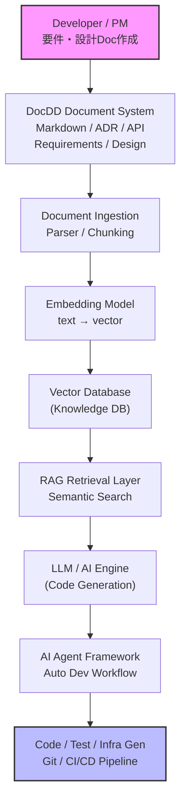

<!-- TOC_START -->
<a id="index"></a>📖 目次

- [1. AIDD × DocDD × RAG 全体システム構成](#1-aidd-docdd-rag-全体システム構成)
  - [全体アーキテクチャ](#全体アーキテクチャ)
- [2. 各レイヤー詳細](#2-各レイヤー詳細)
- [3. Document Layer（DocDD）](#3-document-layerdocdd)
  - [DocDDドキュメント構成](#docddドキュメント構成)
  - [ドキュメント例](#ドキュメント例)
    - [requirements.md](#requirementsmd)
    - [architecture.md](#architecturemd)
- [4. Knowledge Layer（RAG Knowledge Base）](#4-knowledge-layerrag-knowledge-base)
  - [RAGデータパイプライン](#ragデータパイプライン)
  - [データ処理](#データ処理)
    - [① Parsing](#①-parsing)
    - [② Chunking](#②-chunking)
    - [③ Embedding](#③-embedding)
    - [④ Vector Database](#④-vector-database)
- [5. Retrieval Layer（検索）](#5-retrieval-layer検索)
  - [Retrievalフロー](#retrievalフロー)
- [6. AI Generation Layer（LLM）](#6-ai-generation-layerllm)
  - [Prompt構造](#prompt構造)
  - [出力](#出力)
- [7. AI Agent Layer（AIDD）](#7-ai-agent-layeraidd)
  - [AIエージェント構成](#aiエージェント構成)
  - [例](#例)
    - [Code Agent](#code-agent)
    - [Test Agent](#test-agent)
    - [Infra Agent](#infra-agent)
- [8. DevOps Layer](#8-devops-layer)
  - [CI/CD構成](#cicd構成)
- [9. データフロー（重要）](#9-データフロー重要)
  - [開発フロー](#開発フロー)
  - [図](#図)
- [10. 実際の技術スタック](#10-実際の技術スタック)
  - [Frontend](#frontend)
  - [Backend](#backend)
  - [RAG](#rag)
  - [VectorDB](#vectordb)
  - [LLM](#llm)
  - [Agent](#agent)
<!-- TOC_END -->

# ◆ AIDD × DocDD × RAG 開発方式概要

**AIDD × DocDD × RAG** は、現在のエンタープライズAI開発で非常に重要なアーキテクチャです。  
簡単に言うと次の構造になります。

```
DocDD（ドキュメント中心開発）
        ↓
RAG（企業知識検索）
        ↓
AIDD（AI自動開発）
```

つまり

**「ドキュメントを知識としてAIが理解し、AIが開発を行うシステム」**

です。

以下では **システム構成図 → コンポーネント → データフロー → 実装例** まで詳細に説明します。

---

## 1. AIDD × DocDD × RAG 全体システム構成
[🔙 目次に戻る](#index)


### 全体アーキテクチャ
[🔙 目次に戻る](#index)



---

## 2. 各レイヤー詳細
[🔙 目次に戻る](#index)


このアーキテクチャは **6つのレイヤー**で構成されます。

```
① Document Layer
② Knowledge Layer
③ Retrieval Layer
④ AI Generation Layer
⑤ Agent Layer
⑥ DevOps Layer
```

---

## 3. Document Layer（DocDD）
[🔙 目次に戻る](#index)


DocDDでは

**ドキュメントがシステムの真実**

になります。

```
Docs = System Source
```

DocDDでは、コードより先にドキュメントを作成します。
そのドキュメントをAIが読み取り、コードやテストを生成します。 ([ドキュメント駆動開発][1])

---

### DocDDドキュメント構成
[🔙 目次に戻る](#index)


例

```
docs/
 ├ requirements.md
 ├ architecture.md
 ├ api-spec.yaml
 ├ database-design.md
 ├ security-policy.md
 └ operations.md
```

---

### ドキュメント例
[🔙 目次に戻る](#index)


#### requirements.md
[🔙 目次に戻る](#index)


```
System: Customer Support AI

Feature:
- ticket classification
- automatic response
- knowledge search
```

---

#### architecture.md
[🔙 目次に戻る](#index)


```
Architecture:
- Frontend: React
- Backend: FastAPI
- DB: PostgreSQL
- AI: RAG
```

---

## 4. Knowledge Layer（RAG Knowledge Base）
[🔙 目次に戻る](#index)


DocDDドキュメントは **RAGの知識ベース**になります。

RAGとは

**検索 + AI生成**

を組み合わせた技術です。
ユーザー質問に対して関連情報を検索し、その情報をコンテキストとしてLLMが回答を生成します。

---

### RAGデータパイプライン
[🔙 目次に戻る](#index)


```
Document
 ↓
Parsing
 ↓
Chunking
 ↓
Embedding
 ↓
VectorDB
```

---

### データ処理
[🔙 目次に戻る](#index)


#### ① Parsing
[🔙 目次に戻る](#index)


```
PDF
Word
Markdown
HTML
```

↓

```
Text
Metadata
```

---

#### ② Chunking
[🔙 目次に戻る](#index)


文章を小さく分割

例

```
512 token
overlap 128
```

---

#### ③ Embedding
[🔙 目次に戻る](#index)


```
Text → Vector
```

例

```
"API design principles"
↓

[0.234, -0.552, 0.934, ...]
```

---

#### ④ Vector Database
[🔙 目次に戻る](#index)


保存

```
Vector + metadata
```

例

```
Weaviate
Pinecone
Milvus
pgvector
```

---

## 5. Retrieval Layer（検索）
[🔙 目次に戻る](#index)


ユーザーが質問すると

```
Query
 ↓
Embedding
 ↓
Vector search
 ↓
TopK documents
```

---

### Retrievalフロー
[🔙 目次に戻る](#index)


```
User Query
 ↓
Query Embedding
 ↓
Vector Search
 ↓
TopK documents
 ↓
Context Builder
```

---

## 6. AI Generation Layer（LLM）
[🔙 目次に戻る](#index)


RAGで取得した情報を **LLMに渡して生成**します。

---

### Prompt構造
[🔙 目次に戻る](#index)


```
System:
You are a software architect

Context:
[retrieved docs]

Question:
Generate API design
```

---

### 出力
[🔙 目次に戻る](#index)


```
FastAPI implementation
```

---

## 7. AI Agent Layer（AIDD）
[🔙 目次に戻る](#index)


ここが **AIDDの核心**です。

AIが開発作業を自動化します。

---

### AIエージェント構成
[🔙 目次に戻る](#index)


```
AI Orchestrator
      │
      ├ Code Agent
      ├ Test Agent
      ├ Infra Agent
      ├ Security Agent
      └ Review Agent
```

---

### 例
[🔙 目次に戻る](#index)


#### Code Agent
[🔙 目次に戻る](#index)


```
Doc → code
```

例

```
API spec
↓
FastAPI code
```

---

#### Test Agent
[🔙 目次に戻る](#index)


```
Doc → test
```

例

```
API spec
↓
pytest
```

---

#### Infra Agent
[🔙 目次に戻る](#index)


```
Architecture doc
↓
Terraform
```

---

## 8. DevOps Layer
[🔙 目次に戻る](#index)


生成されたコードは

```
Git
CI/CD
```

に流れます。

---

### CI/CD構成
[🔙 目次に戻る](#index)


```
GitHub
 ↓
GitHub Actions
 ↓
Build
 ↓
Test
 ↓
Deploy
```

---

## 9. データフロー（重要）
[🔙 目次に戻る](#index)


### 開発フロー
[🔙 目次に戻る](#index)


```
1 Developer writes document
2 Document stored
3 RAG indexing
4 AI retrieves context
5 AI generates code
6 CI/CD deploy
```

---

### 図
[🔙 目次に戻る](#index)


```
Doc
 ↓
VectorDB
 ↓
RAG
 ↓
LLM
 ↓
Code
 ↓
Deploy
```

---

## 10. 実際の技術スタック
[🔙 目次に戻る](#index)


### Frontend
[🔙 目次に戻る](#index)


```
React
Next.js
```

---

### Backend
[🔙 目次に戻る](#index)


```
FastAPI
Node.js
```

---

### RAG
[🔙 目次に戻る](#index)


```
LangChain
LlamaIndex
Haystack
```

---

### VectorDB
[🔙 目次に戻る](#index)


```
Pinecone
Weaviate
Milvus
pgvector
```

---

### LLM
[🔙 目次に戻る](#index)


```
OpenAI
Claude
Llama
Mistral
```

---

### Agent
[🔙 目次に戻る](#index)


```
CrewAI
LangGraph
AutoGPT
```

---

