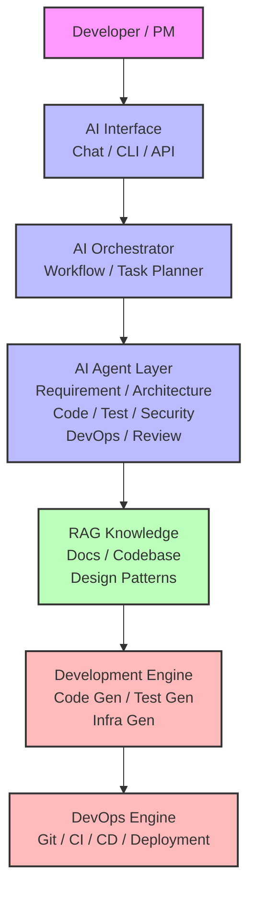

# ◆ AI自律開発OS（AutoDev OS）

**AI自律開発OS（AutoDev OS：Autonomous Development Operating System）** とは、
AIエージェントが **ソフトウェア開発の全工程（要件→設計→実装→テスト→運用）を自律的に実行するための基盤プラットフォーム**です。

従来の開発環境（IDE + CI/CD + チーム）を、
**AIエージェント主体の「開発OS」** として再構成したものです。

---

# 1. AutoDev OSとは

概念

```
人間開発
Developer → Code → Deploy
```

↓

```
AutoDev
AI → Design → Code → Test → Deploy
```

つまり

```
AI = 開発主体
人間 = 監督
```

になります。

---

# 2. AutoDev OSの全体アーキテクチャ



このMermaid図では、以下の要素を表現しています：

1. **フロー**：上から下への一貫したデータ/指示の流れ
2. **各ノード**：
   - `Developer / PM`：開始点（紫色）
   - `AI Interface`：ユーザーとの接点（青色）
   - `AI Orchestrator`：タスク計画（青色）
   - `AI Agent Layer`：複数の専門エージェント（青色）
   - `RAG Knowledge`：知識ベース（緑色）
   - `Development Engine`：コード生成（赤色）
   - `DevOps Engine`：デプロイ（赤色）

3. **色分け**：
   - 紫色：人間の役割
   - 青色：AI関連の意思決定層
   - 緑色：知識ベース
   - 赤色：実行/生成エンジン

---

# 3. AutoDev OSの主要コンポーネント

AutoDev OSは **7つの主要サブシステム**で構成されます。

| サブシステム            | 役割       |
| ----------------- | -------- |
| AI Interface      | 人間との対話   |
| Orchestrator      | AIタスク管理  |
| Agent System      | 開発エージェント |
| Knowledge System  | RAG知識    |
| Generation Engine | 成果物生成    |
| DevOps Engine     | CI/CD    |
| Governance System | 監査・制御    |

---

# 4. AI Interface

ユーザーは **チャットで開発指示**を出します。

例

```
Create a ticket management API
```

インターフェース例

* Chat UI
* CLI
* API
* IDE Plugin

---

# 5. AI Orchestrator

AutoDev OSの**カーネル的存在**です。

役割

```
タスク分解
エージェント管理
ワークフロー制御
コンテキスト共有
```

処理

```
User Request
↓
Task Planning
↓
Agent Execution
↓
Result Integration
```

---

# 6. AI Agent System

AutoDev OSでは通常 **10エージェント構成**を使います。

```
AI Orchestrator
      │
      ├ Requirement Agent
      ├ Product Agent
      ├ Architecture Agent
      ├ Data Agent
      ├ Code Agent
      ├ Test Agent
      ├ Security Agent
      ├ DevOps Agent
      ├ Review Agent
      └ Knowledge Agent
```

役割

```
要件
設計
実装
テスト
運用
```

を分担します。

---

# 7. Knowledge System（RAG）

AutoDev OSは **RAG知識ベース**を利用します。

知識

```
DocDDドキュメント
設計パターン
コードベース
技術文書
```

構造

```
Documents
↓
Embedding
↓
Vector DB
↓
Search
↓
LLM
```

---

# 8. Development Engine

AIが生成する成果物

```
Backend Code
Frontend Code
API
Database Schema
Infrastructure
```

例

```
FastAPI
Spring Boot
React
Terraform
```

---

# 9. DevOps Engine

生成コードは自動でCI/CDへ。

```
Git
↓
CI
↓
Build
↓
Test
↓
Deploy
```

例

```
GitHub
GitHub Actions
ArgoCD
Kubernetes
```

---

# 10. Governance System

企業利用では重要です。

機能

```
Access Control
Audit Logs
Policy Enforcement
Security Scan
```

---

# 11. AutoDev OSの開発フロー

従来

```
Human
↓
Design
↓
Code
↓
Test
↓
Deploy
```

AutoDev

```
User request
↓
Requirement Agent
↓
Architecture Agent
↓
Code Agent
↓
Test Agent
↓
Security Agent
↓
DevOps Agent
↓
Deploy
```

---

# 12. 技術スタック例

AutoDev OSの実装例

### LLM

```
OpenAI
Claude
Llama
```

### Agent Framework

```
LangGraph
CrewAI
Semantic Kernel
```

### RAG

```
LangChain
LlamaIndex
Haystack
```

### VectorDB

```
Milvus
Weaviate
Pinecone
pgvector
```

### DevOps

```
GitHub
Docker
Kubernetes
Terraform
```

---

# 13. AutoDev OSの特徴

| 特徴       | 内容     |
| -------- | ------ |
| 自律開発     | AIが開発  |
| RAG統合    | 知識利用   |
| エージェント分業 | AIチーム  |
| DevOps統合 | 自動デプロイ |

---

# まとめ

**AutoDev OS**

```
AI Autonomous Development Platform
```

構造

```
User
↓
AI Interface
↓
Orchestrator
↓
AI Agents
↓
Code Generation
↓
DevOps
↓
Deployment
```

---
