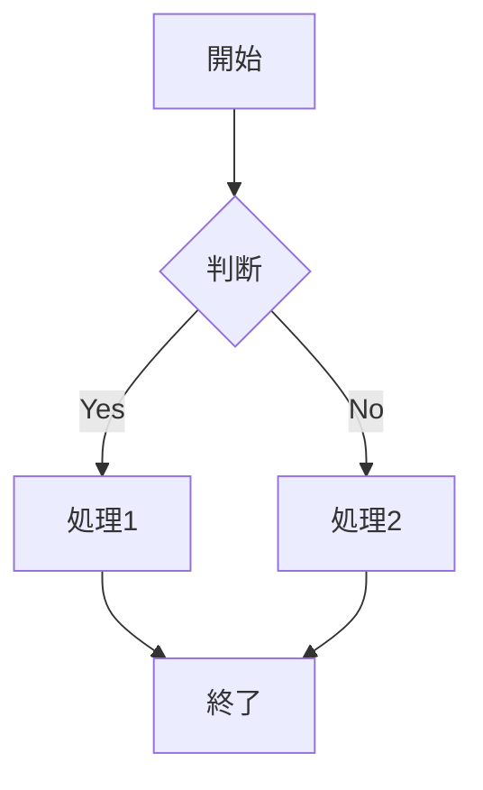

# ◆ Markdown 基本記法

**Markdown**は、シンプルな記法で文書構造を表現できる軽量マークアップ言語です。プレーンテキストで記述でき、可読性が高く、ドキュメントや技術資料、READMEなどで広く利用されます。見出し（#）、箇条書き（-）、強調、リンク、コードブロックなどの基本記法により、構造化された文書を容易に作成できます。HTML変換やGitHub等での標準サポートにより、開発・業務の両面で活用されています。**AI分野**では、プロンプト設計やナレッジ管理、RAGにおけるデータ記述形式として重要性が高く、人とAI双方にとって扱いやすい共通フォーマットとして機能します。

本教材ではMarkdownの基本記法を習得します。

---

## <a id="index"></a>📖 目次

- [1. 見出し](#1-見出し)
- [2. 強調](#2-強調)
- [3. リスト](#3-リスト)
- [4. リンク](#4-リンク)
- [5. 画像](#5-画像)
- [6. コード](#6-コード)
- [7. 引用](#7-引用)
- [8. テーブル](#8-テーブル)
- [9. チェックボックス（タスクリスト）](#9-チェックボックスタスクリスト)
- [10. エスケープ](#10-エスケープ)
- [11. 改行](#11-改行)
- [12. 脚注(Githubのみ対応)](#12-脚注Githubのみ対応)
- [13. 水平線](#13-水平線)
- [14. HTMLタグ](#14-HTMLタグ)
- [15. Mermaid図記法](#15-Mermaid図記法)
- [16. LaTeX記法](#16-LaTeX記法)
- [17. 目次と戻る記法](#17-目次と戻る記法)
- [本教材編集履歴](#本教材編集履歴)

---

## 1. 見出し

1個から6個シャープで見出しをつける

```markdown
# 見出し1
## 見出し2
### 見出し3
#### 見出し4
##### 見出し5
###### 見出し6
```
#### 〇表示例

# 見出し1
## 見出し2
### 見出し3
#### 見出し4
##### 見出し5
###### 見出し6

[🔝 目次に戻る](#index)

---

## 2. 強調

```markdown
*イタリック* または _イタリック_
**太字** または __太字__
***太字イタリック*** または ___太字イタリック___
~~取り消し線~~
```

#### 〇表示例

*イタリック* または _イタリック_  
**太字** または __太字__  
***太字イタリック*** または ___太字イタリック___  
~~取り消し線~~

[🔝 目次に戻る](#index)

---

## 3. リスト

### 箇条書き（順序なし）
ハイフン, プラス, アスタリスクとスペースでリストを作成できる。  
ネストはtabかスペース二つで作成可能

```markdown
- 項目1
- 項目2
  - ネスト1
  - ネスト2
* アスタリスクでも可能
+ プラスでも可能
```

#### 〇表示例

- 項目1
- 項目2
  - ネスト1
  - ネスト2
* アスタリスクでも可能
+ プラスでも可能

### 番号付きリスト（順序あり）

数値と半角ドットで番号付きリストを作成可能  
番号は何でもよい  

```markdown
1. 項目1
2. 項目2
   1. ネスト1
   2. ネスト2
3. 項目3
```

#### 〇表示例

1. 項目1
2. 項目2
   1. ネスト1
   2. ネスト2
3. 項目3

[🔝 目次に戻る](#index)

---

## 4. リンク

`[表示文字](URL)`でリンクを表示できる

```markdown
[テキスト](https://example.com)
[テキスト](https://example.com "タイトル")
<https://example.com>
<email@example.com>
```

#### 〇表示例

[テキスト](https://example.com)  
[テキスト](https://example.com "タイトル")  
<https://example.com>  
<email@example.com>

### 定義参照リンク
Markdownの文書の途中に長いリンクを記述したくない場合は、
同じリンクの参照を何度も利用する場合は、リンク先への参照を定義することができます。

```
[今回の参考URL]:https://qiita.com/tbpgr/items/989c6badefff69377da7

定義参照リンクの表示

[今回の参考URL]

定義参照リンクの表示を変えるには以下のようにすればいい.

[参考にしたページはこちら][今回の参考URL]

```

#### 〇表示例

[今回の参考URL]:https://qiita.com/tbpgr/items/989c6badefff69377da7

定義参照リンクの表示

[今回の参考URL]

定義参照リンクの表示を変えるには以下のようにすればいい.

[参考にしたページはこちら][今回の参考URL]

[🔝 目次に戻る](#index)

---

## 5. 画像

```markdown


```

#### 〇表示例


[🔝 目次に戻る](#index)

---

## 6. コード

### インラインコード
```markdown
`コード` をインラインで記述
```

#### 〇表示例

`コード` をインラインで記述

### コードブロック

````markdown
```言語名
// コードブロック
function hello() {
  console.log("Hello, World!");
}
```
````

#### 〇表示例

```javascript
// コードブロック
function hello() {
  console.log("Hello, World!");
}
```

[🔝 目次に戻る](#index)

---

## 7. 引用
小なり記号で引用ができる

```markdown
> 引用文
> 複数行にまたがる引用
>> ネストした引用
```

#### 〇表示例

> 引用文
> 複数行にまたがる引用
>> ネストした引用

[🔝 目次に戻る](#index)

---

## 8. テーブル

```markdown
| 左揃え | 中央揃え | 右揃え |
|:-------|:--------:|-------:|
| セル1  | セル2    | セル3  |
| セル4  | セル5    | セル6  |
```

#### 〇表示例

| 左揃え | 中央揃え | 右揃え |
|:-------|:--------:|-------:|
| セル1  | セル2    | セル3  |
| セル4  | セル5    | セル6  |

[🔝 目次に戻る](#index)

---

## 9. チェックボックス（タスクリスト）

```markdown
- [x] 完了したタスク
- [ ] 未完了のタスク
- [ ] 別のタスク
```

#### 〇表示例

- [x] 完了したタスク
- [ ] 未完了のタスク
- [ ] 別のタスク

[🔝 目次に戻る](#index)

---

## 10. エスケープ

Markdown記法として解釈させたくない場合は、バックスラッシュ `\` でエスケープします。

```markdown
\*アスタリスク\* は強調にならない
```

#### 〇表示例

\*アスタリスク\* は強調にならない

[🔝 目次に戻る](#index)

---

## 11. 改行

行末にスペースを二ついれると改行される
```markdown
これが  
テストdeth
空白を入れないとこうなるよ
```

#### 〇表示例

これが  
テストdeth
空白を入れないとこうなるよ

[🔝 目次に戻る](#index)

---

## 12. 脚注(Githubのみ対応)

```markdown
脚注の例です[^1]。

[^1]: これは脚注の内容です。
```

#### 〇表示例

脚注の例です[^1]。

[^1]: これは脚注の内容です。

[🔝 目次に戻る](#index)

---

## 13. 水平線

```markdown
---
***
___
- - -
```

#### 〇表示例

---
***
___
- - -

[🔝 目次に戻る](#index)

---

## 14. HTMLタグ
Markdown記法はもともと、ホームページを簡単に書くことを目的として作成されています。
よって、MarkDown記法にない装飾等は、HTMLタグが使えます。

```html
<div align="center">真ん中に寄せてみた</div>
```

#### 〇表示例

<div align="center">真ん中に寄せてみた</div>

[🔝 目次に戻る](#index)

---

## 15. Mermaid図記法

[Mermaid（マーメイド）](https://mermaid.js.org/)は、Markdownライクなテキストベースの記法で、フローチャートやシーケンス図、ガントチャート、ER図などの様々な図表を自動生成できるツールです。最大の特徴は、コードとして図を管理できるため、修正が容易でバージョン管理とも相性が良い点です。AI開発において仕様書や設計書などのドキュメントに利用されています。

多くのMarkdown環境では、Mermaid図記法もサポートされています。  
※ただし、サポートされていない環境もあります。

````Markdown

````

#### 〇表示例


[🔝 目次に戻る](#index)

---

## 16. LaTeX記法

[LaTeX（ラテフ/ラテック）](https://www.latex-project.org/)記法は、特殊なコマンドを用いて数式や構造化された文書をテキストベースで記述し、美しくレイアウトする組版システムです。AI開発における仕様書や設計書などのドキュメントにおいて利用されています。

多くのMarkdown環境では、LaTeX記法もサポートされています。  
※ただし、サポートされていない環境もあります。

```Markdown
インライン数式： $E = mc^2$ の例です。  
括弧分数表示： $\left(\frac{1}{2}\right)$  
文字色： $\color{red}{\text{赤文字}}$
```

#### 〇表示例

インライン数式： $E = mc^2$ の例です。  
括弧分数表示： $\left(\frac{1}{2}\right)$  
文字色： $\color{red}{\text{赤文字}}$

[🔝 目次に戻る](#index)

---

## 17. 目次と戻る記法

### 目次に「ID」を設定する
まず、戻り先となる目次の見出しにIDを割り振ります。
HTMLのタグを少し混ぜるのが最も確実な方法です。

```markdown
## <a id="index"></a>目次
1. [セクションA](#セクションA)
2. [セクションB](#セクションB)
```

### 「目次に戻る」リンクを作成する
各セクションの終わりに、先ほど設定したID（`#index`）へ飛ぶリンクを配置します。

```markdown
### セクションA
ここに本文が入ります。

[▲ 目次に戻る](#index)
```
### HTMLを使わない方法（GitHubやQiitaなど）
多くのMarkdown環境（GitHub, Zenn, Qiitaなど）では、**見出しが自動的にIDとして処理されます。** その場合、HTMLタグを書かなくても以下のようにリンクを貼るだけで機能します。

* 目次の見出しが `## 目次` なら → `(#目次)`
* 目次の見出しが `## Table of Contents` なら → `#table-of-contents`
    * ※英字の場合は小文字になり、スペースをハイフン `-` に置き換わるのが一般的です。
* 目次の見出しが `## Table:of+(Contents)` なら → `#tableofcontents`
    * ※記号の場合は`:`、`+`、`(`、`)`などを削除するのが一般的です。

[🔝 目次に戻る](#index)

---

## 本教材編集履歴

|作成者|バージョン|   日付   |　内容   |
|------|-------|----------|----------|
| Y.F  |1.0.0  |2026-03-31|新規作成|

repository: [https://github.com/8alfalfa8/Tec-Doc](https://github.com/8alfalfa8/Tec-Doc)

[🔝 目次に戻る](#index)

---
