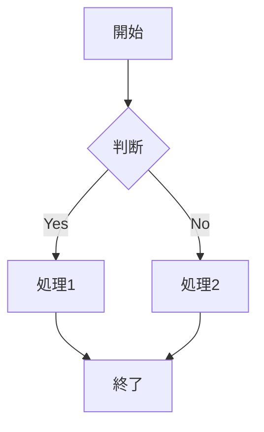

# ◆ Markdown 基本記法

Markdown（マークダウン）は、シンプルな記法で文書構造を表現できる軽量マークアップ言語です。
プレーンテキストで記述できるため、特別なツールがなくても作成・閲覧が可能であり、可読性の高さが特徴です。
主にドキュメント作成、ブログ記事、技術資料、READMEファイルなどで広く利用されています。

基本的な記法として、見出しは「#」、箇条書きは「-」や「*」、強調は「`**`**太字**`**`」や「`*` *斜体* `*`」、リンクは「`[表示名](URL)`」の形式で記述します。また、コードは「```」で囲むことで見やすく表現でき、エンジニア向けドキュメントとの相性が非常に良いです。

MarkdownはHTMLへの変換が容易であり、GitHubや各種CMS、チャットツールなど多くのサービスで標準的にサポートされています。
そのため、開発現場だけでなく、ビジネス用途や個人メモにも活用されています。

さらに近年では、AI開発との親和性の高さが注目されています。
生成AIやプロンプト設計、ナレッジ管理、RAG（検索拡張生成）などにおいて、構造化されたテキストとしてMarkdownが標準的に利用されるケースが増えています。
人間にもAIにも読みやすい形式であることから、仕様書・設計書・学習データの記述形式として非常に適しており、AIと人間の橋渡しとなる重要な役割を担います。

このようにMarkdownは、単なる文書記述ツールを超え、将来のAI開発において欠かせない基盤技術の一つとして、その重要性がますます高まっています。

以下では、Markdownの基本記法について説明します。

---

## 1. 見出し

1個から6個シャープで見出しをつける

```markdown
# 見出し1
## 見出し2
### 見出し3
#### 見出し4
##### 見出し5
###### 見出し6
```
#### 〇表示例

# 見出し1
## 見出し2
### 見出し3
#### 見出し4
##### 見出し5
###### 見出し6

---

## 2. 強調

```markdown
*イタリック* または _イタリック_
**太字** または __太字__
***太字イタリック*** または ___太字イタリック___
~~取り消し線~~
```

#### 〇表示例

*イタリック* または _イタリック_  
**太字** または __太字__  
***太字イタリック*** または ___太字イタリック___  
~~取り消し線~~

---

## 3. リスト

### 箇条書き（順序なし）
ハイフン, プラス, アスタリスクとスペースでリストを作成できる。  
ネストはtabかスペース二つで作成可能

```markdown
- 項目1
- 項目2
  - ネスト1
  - ネスト2
* アスタリスクでも可能
+ プラスでも可能
```

#### 〇表示例

- 項目1
- 項目2
  - ネスト1
  - ネスト2
* アスタリスクでも可能
+ プラスでも可能

### 番号付きリスト（順序あり）

数値と半角ドットで番号付きリストを作成可能  
番号は何でもよい  

```markdown
1. 項目1
2. 項目2
   1. ネスト1
   2. ネスト2
3. 項目3
```

#### 〇表示例

1. 項目1
2. 項目2
   1. ネスト1
   2. ネスト2
3. 項目3

---

## 4. リンク

`[表示文字](URL)`でリンクを表示できる

```markdown
[テキスト](https://example.com)
[テキスト](https://example.com "タイトル")
<https://example.com>
<email@example.com>
```

#### 〇表示例

[テキスト](https://example.com)  
[テキスト](https://example.com "タイトル")  
<https://example.com>  
<email@example.com>

### 定義参照リンク
Markdownの文書の途中に長いリンクを記述したくない場合は、
同じリンクの参照を何度も利用する場合は、リンク先への参照を定義することができます。

```
[今回の参考URL]:https://qiita.com/tbpgr/items/989c6badefff69377da7

定義参照リンクの表示

[今回の参考URL]

定義参照リンクの表示を変えるには以下のようにすればいい.

[参考にしたページはこちら][今回の参考URL]

```

#### 〇表示例

[今回の参考URL]:https://qiita.com/tbpgr/items/989c6badefff69377da7

定義参照リンクの表示

[今回の参考URL]

定義参照リンクの表示を変えるには以下のようにすればいい.

[参考にしたページはこちら][今回の参考URL]

---

## 5. 画像

```markdown


```

#### 〇表示例


---

## 6. コード

### インラインコード
```markdown
`コード` をインラインで記述
```

#### 〇表示例

`コード` をインラインで記述

### コードブロック

````markdown
```言語名
// コードブロック
function hello() {
  console.log("Hello, World!");
}
```
````

#### 〇表示例

```javascript
// コードブロック
function hello() {
  console.log("Hello, World!");
}
```

---

## 7. 引用
小なり記号で引用ができる

```markdown
> 引用文
> 複数行にまたがる引用
>> ネストした引用
```

#### 〇表示例

> 引用文
> 複数行にまたがる引用
>> ネストした引用

---

## 8. テーブル

```markdown
| 左揃え | 中央揃え | 右揃え |
|:-------|:--------:|-------:|
| セル1  | セル2    | セル3  |
| セル4  | セル5    | セル6  |
```

#### 〇表示例

| 左揃え | 中央揃え | 右揃え |
|:-------|:--------:|-------:|
| セル1  | セル2    | セル3  |
| セル4  | セル5    | セル6  |

---

## 9. チェックボックス（タスクリスト）

```markdown
- [x] 完了したタスク
- [ ] 未完了のタスク
- [ ] 別のタスク
```

#### 〇表示例

- [x] 完了したタスク
- [ ] 未完了のタスク
- [ ] 別のタスク

---

## 10. エスケープ

Markdown記法として解釈させたくない場合は、バックスラッシュ `\` でエスケープします。

```markdown
\*アスタリスク\* は強調にならない
```

#### 〇表示例

\*アスタリスク\* は強調にならない

---

## 11. 改行

行末にスペースを二ついれると改行される
```markdown
これが  
テストdeth
空白を入れないとこうなるよ
```

#### 〇表示例

これが  
テストdeth
空白を入れないとこうなるよ

---

## 12. 脚注

```markdown
脚注の例です[^1]。

[^1]: これは脚注の内容です。
```

#### 〇表示例

脚注の例です[^1]。

[^1]: これは脚注の内容です。

---

## 13. 定義リスト

```markdown
用語1
: 定義1

用語2
: 定義2
: 別の定義
```

#### 〇表示例

用語1
: 定義1

用語2
: 定義2
: 別の定義

---
## 14. 水平線

```markdown
---
***
___
- - -
```

#### 〇表示例

---
***
___
- - -

## 15. HTMLタグ
Markdown記法はもともと、ホームページを簡単に書くことを目的として作成されています。
よって、MarkDown記法にない装飾等は、HTMLタグが使えますよ。

```html
<div align="center">真ん中に寄せてみた</div>
```

#### 〇表示例

<div align="center">真ん中に寄せてみた</div>

---

## 16. Mermaid図記法

シンプルなテキストで複雑な図を描画できるため、AI開発において仕様書や設計書などのドキュメントに利用されています。

多くのMarkdown環境では、Mermaid図記法もサポートされています。  
※ただし、サポートされていない環境もあります。

````Markdown

````

#### 〇表示例


---

## 17. LaTeX記法
数式表現やアルゴリズムの定義を整然と表示できるため、AI開発における仕様書や設計書などのドキュメントにおいて利用されています。

多くのMarkdown環境では、LaTeX記法もサポートされています。  
※ただし、サポートされていない環境もあります。

```Markdown
インライン数式： $E = mc^2$ の例です。  
括弧分数表示： $\left(\frac{1}{2}\right)$  
文字色： $\color{red}{\text{赤文字}}$
```

#### 〇表示例

インライン数式： $E = mc^2$ の例です。  
括弧分数表示： $\left(\frac{1}{2}\right)$  
文字色： $\color{red}{\text{赤文字}}$

---
