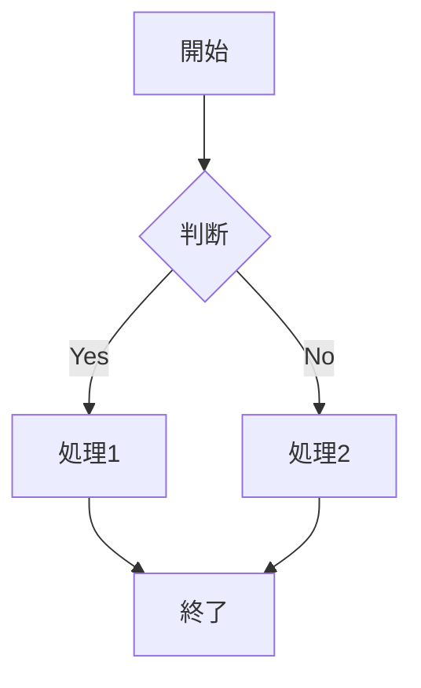

# ◆ Markdown 基本記法

**Markdown**は、シンプルな記法で文書構造を表現できる軽量マークアップ言語です。プレーンテキストで記述でき、可読性が高く、ドキュメントや技術資料、READMEなどで広く利用されます。通常、Markdownで作成されたファイルは「.md」という拡張子で保存され、GitHubなどの環境でそのまま整形表示されるのが特徴です。見出し（#）、箇条書き（-）、強調、リンク、コードブロックなどの基本記法により、構造化された文書を容易に作成できます。HTML変換やGitHub等での標準サポートにより、開発・業務の両面で活用されています。**AI分野**では、プロンプト設計やナレッジ管理、RAGにおけるデータ記述形式として重要性が高く、人とAI双方にとって扱いやすい共通フォーマットとして機能します。

本教材ではMarkdownの基本記法を習得します。

---

## <a id="index"></a>📖 目次

- [1. 見出し](#1-見出し)
- [2. 強調](#2-強調)
- [3. リスト](#3-リスト)
- [4. リンク](#4-リンク)
- [5. 画像](#5-画像)
- [6. コード](#6-コード)
- [7. 引用](#7-引用)
- [8. テーブル](#8-テーブル)
- [9. チェックボックス（タスクリスト）](#9-チェックボックスタスクリスト)
- [10. エスケープ](#10-エスケープ)
- [11. 改行](#11-改行)
- [12. 脚注(Githubのみ対応)](#12-脚注Githubのみ対応)
- [13. 水平線](#13-水平線)
- [14. HTMLタグ](#14-HTMLタグ)
- [15. 折りたたみ](#15-折りたたみ)
- [16. Mermaid図記法](#16-Mermaid図記法)
- [17. LaTeX記法](#17-LaTeX記法)
- [18. 目次と戻る記法](#18-目次と戻る記法)
- [19. コメントアウト記法](#19-コメントアウト記法)
- [付録１： ブラウザ上のMarkdown閲覧環境の整備（Markdown Viewer のインストール）](#付録１-ブラウザ上のMarkdown閲覧環境の整備Markdown-Viewer-のインストール)
- [付録２： 環境別 Markdown HTMLタグ対応](#付録２-環境別-Markdown-HTMLタグ対応
)
- [本教材編集更新履歴](#本教材編集更新履歴)

---

## 1. 見出し

1個から6個シャープで見出しをつける

```markdown
# 見出し1
## 見出し2
### 見出し3
#### 見出し4
##### 見出し5
###### 見出し6
```
#### 〇表示例

# 見出し1
## 見出し2
### 見出し3
#### 見出し4
##### 見出し5
###### 見出し6

[🔝 目次に戻る](#index)

---

## 2. 強調

```markdown
*イタリック* または _イタリック_
**太字** または __太字__
***太字イタリック*** または ___太字イタリック___
~~取り消し線~~
```

#### 〇表示例

*イタリック* または _イタリック_  
**太字** または __太字__  
***太字イタリック*** または ___太字イタリック___  
~~取り消し線~~

[🔝 目次に戻る](#index)

---

## 3. リスト

### 箇条書き（順序なし）
ハイフン, プラス, アスタリスクとスペースでリストを作成できる。  
ネストはtabかスペース二つで作成可能

```markdown
- 項目1
- 項目2
  - ネスト1
  - ネスト2
* アスタリスクでも可能
+ プラスでも可能
```

#### 〇表示例

- 項目1
- 項目2
  - ネスト1
  - ネスト2
* アスタリスクでも可能
+ プラスでも可能

### 番号付きリスト（順序あり）

数値と半角ドットで番号付きリストを作成可能  
番号は何でもよい  

```markdown
1. 項目1
2. 項目2
   1. ネスト1
   2. ネスト2
3. 項目3
```

#### 〇表示例

1. 項目1
2. 項目2
   1. ネスト1
   2. ネスト2
3. 項目3

[🔝 目次に戻る](#index)

---

## 4. リンク

`[表示文字](URL)`でリンクを表示できる

```markdown
[テキスト](https://example.com)
[テキスト](https://example.com "タイトル")
<https://example.com>
<email@example.com>
```

#### 〇表示例

[テキスト](https://example.com)  
[テキスト](https://example.com "タイトル")  
<https://example.com>  
<email@example.com>

### 定義参照リンク
Markdownの文書の途中に長いリンクを記述したくない場合は、
同じリンクの参照を何度も利用する場合は、リンク先への参照を定義することができます。

```
[今回の参考URL]:https://qiita.com/tbpgr/items/989c6badefff69377da7

定義参照リンクの表示

[今回の参考URL]

定義参照リンクの表示を変えるには以下のようにすればいい.

[参考にしたページはこちら][今回の参考URL]

```

#### 〇表示例

[今回の参考URL]:https://qiita.com/tbpgr/items/989c6badefff69377da7

定義参照リンクの表示

[今回の参考URL]

定義参照リンクの表示を変えるには以下のようにすればいい.

[参考にしたページはこちら][今回の参考URL]

[🔝 目次に戻る](#index)

---

## 5. 画像

```markdown


```

#### 〇表示例


[🔝 目次に戻る](#index)

---

## 6. コード

### インラインコード
```markdown
`コード` をインラインで記述
```

#### 〇表示例

`コード` をインラインで記述

### コードブロック

````markdown
```言語名
// コードブロック
function hello() {
  console.log("Hello, World!");
}
```
````

#### 〇表示例

```javascript
// コードブロック
function hello() {
  console.log("Hello, World!");
}
```

[🔝 目次に戻る](#index)

---

## 7. 引用
小なり記号で引用ができる

```markdown
> 引用文
> 複数行にまたがる引用
>> ネストした引用
```

#### 〇表示例

> 引用文
> 複数行にまたがる引用
>> ネストした引用

[🔝 目次に戻る](#index)

---

## 8. テーブル

```markdown
| 左揃え | 中央揃え | 右揃え |
|:-------|:--------:|-------:|
| セル1  | セル2    | セル3  |
| セル4  | セル5    | セル6  |
```

#### 〇表示例

| 左揃え | 中央揃え | 右揃え |
|:-------|:--------:|-------:|
| セル1  | セル2    | セル3  |
| セル4  | セル5    | セル6  |

[🔝 目次に戻る](#index)

---

## 9. チェックボックス（タスクリスト）

```markdown
- [x] 完了したタスク
- [ ] 未完了のタスク
- [ ] 別のタスク
```

#### 〇表示例

- [x] 完了したタスク
- [ ] 未完了のタスク
- [ ] 別のタスク

[🔝 目次に戻る](#index)

---

## 10. エスケープ

Markdown記法として解釈させたくない場合は、バックスラッシュ `\` でエスケープします。

```markdown
\*アスタリスク\* は強調にならない
```

#### 〇表示例

\*アスタリスク\* は強調にならない

[🔝 目次に戻る](#index)

---

## 11. 改行

行末にスペースを二ついれると改行される
```markdown
これが  
テストdeth
空白を入れないとこうなるよ
```

#### 〇表示例

これが  
テストdeth
空白を入れないとこうなるよ

[🔝 目次に戻る](#index)

---

## 12. 脚注(Githubのみ対応)

```markdown
脚注の例です[^1]。

[^1]: これは脚注の内容です。
```

#### 〇表示例

脚注の例です[^1]。

[^1]: これは脚注の内容です。

[🔝 目次に戻る](#index)

---

## 13. 水平線

```markdown
---
***
___
- - -
```

#### 〇表示例

---
***
___
- - -

[🔝 目次に戻る](#index)

---

## 14. HTMLタグ
Markdown記法はもともと、ホームページを簡単に書くことを目的として作成されています。
よって、MarkDown記法にない装飾等は、HTMLタグが使えます。

```html
<div align="center">真ん中に寄せてみた</div>
```

#### 〇表示例

<div align="center">真ん中に寄せてみた</div>

[🔝 目次に戻る](#index)

---
## 15. 折りたたみ

```html
<details>
<summary>xxx</summary>

aaaaaaaaaaaaaaaaaaaaa
bbbbbbbbbbbbbbbbbbb
ccccccccccccccccccccc
</details>
```

#### 〇表示例

<details>
<summary>xxx</summary>

aaaaaaaaaaaaaaaaaaaaa
bbbbbbbbbbbbbbbbbbb
ccccccccccccccccccccc
</details>

[🔝 目次に戻る](#index)

---
## 16. Mermaid図記法

[Mermaid（マーメイド）](https://mermaid.js.org/)は、Markdownライクなテキストベースの記法で、フローチャートやシーケンス図、ガントチャート、ER図などの様々な図表を自動生成できるツールです。最大の特徴は、コードとして図を管理できるため、修正が容易でバージョン管理とも相性が良い点です。AI開発において仕様書や設計書などのドキュメントに利用されています。

多くのMarkdown環境では、Mermaid図記法もサポートされています。  
※ただし、サポートされていない環境もあります。

````Markdown

````

#### 〇表示例


[🔝 目次に戻る](#index)

---

## 17. LaTeX記法

[LaTeX（ラテフ/ラテック）](https://www.latex-project.org/)記法は、特殊なコマンドを用いて数式や構造化された文書をテキストベースで記述し、美しくレイアウトする組版システムです。AI開発における仕様書や設計書などのドキュメントにおいて利用されています。

多くのMarkdown環境では、LaTeX記法もサポートされています。  
※ただし、サポートされていない環境もあります。

```Markdown
インライン数式： $E = mc^2$ の例です。  
括弧分数表示： $\left(\frac{1}{2}\right)$  
文字色： $\color{red}{\text{赤文字}}$
```

#### 〇表示例

インライン数式： $E = mc^2$ の例です。  
括弧分数表示： $\left(\frac{1}{2}\right)$  
文字色： $\color{red}{\text{赤文字}}$

[🔝 目次に戻る](#index)

---

## 18. 目次と戻る記法

### 目次に「ID」を設定する
まず、戻り先となる目次の見出しにIDを割り振ります。
HTMLのタグを少し混ぜるのが最も確実な方法です。

```markdown
## <a id="index"></a>目次
1. [セクションA](#セクションA)
2. [セクションB](#セクションB)
```

### 「目次に戻る」リンクを作成する
各セクションの終わりに、先ほど設定したID（`#index`）へ飛ぶリンクを配置します。

```markdown
### セクションA
ここに本文が入ります。

[▲ 目次に戻る](#index)
```
### HTMLを使わない方法（GitHubやQiitaなど）
多くのMarkdown環境（GitHub, Zenn, Qiitaなど）では、**見出しが自動的にIDとして処理されます。** その場合、HTMLタグを書かなくても以下のようにリンクを貼るだけで機能します。

* 目次の見出しが `## 目次` なら → `(#目次)`
* 目次の見出しが `## Table of Contents` なら → `#table-of-contents`
    * ※英字の場合は小文字になり、スペースをハイフン `-` に置き換わるのが一般的です。
* 目次の見出しが `## Table:of+(Contents)` なら → `#tableofcontents`
    * ※記号の場合は`:`、`+`、`(`、`)`などを削除するのが一般的です。

[🔝 目次に戻る](#index)

---

## 19. コメントアウト記法

### 基本：HTMLコメントを使う方法（推奨）

もっとも汎用性が高く、GitHubやQiita、VS Codeなど大半の環境で正しく機能します。 

* 単一箇所のコメントアウト

```markdown
<!-- ここにコメントを書きます。画面には表示されません -->
```

* 複数行のコメントアウト

```markdown
<!-- 
ここも、
あそこも、まとめて非表示になります。
-->
```

### リンク参照記法を応用する方法
一部のパーサー（解析器）で利用できる、Markdown独自の「リンク参照」の仕組みをハックした方法です。HTMLタグを打ちたくない場合に便利です。

```markdwon
[comment]: <> (ここにコメントを書く)
[//]: # (これでも非表示になります)
```

* 注意点: プラットフォーム（Notionや一部のエディタなど）によっては、そのまま画面に文字列が露出してしまうケースがあるため、事前にプレビューで確認してください。

### 【番外編】コードブロック内でのコメントアウト

Markdownの文章内ではなく、``` で囲まれたコードブロックの中でコメントアウトしたい場合は、その「プログラミング言語」の規則に従います。 

* JavaScript / Python などの例

```javascript
// JavaScriptの1行コメント
/* 複数行の
   コメント */
```

```Python
# Pythonのコメント
```

[🔝 目次に戻る](#index)

---

## 付録１: ブラウザ上のMarkdown閲覧環境の整備（Markdown Viewer のインストール）

Markdown記法のドキュメントをブラウザで正しく閲覧し、図解（Mermaid）を表示させるために、ブラウザ拡張機能 **「Markdown Viewer」** のインストールと設定を推奨しています。

### 1. インストール
お使いのブラウザに合わせて、以下のリンクからインストールしてください。

* **Chrome / Edge**: [Markdown Viewer (Chrome Web Store)](https://chrome.google.com/webstore/detail/markdown-viewer/ckkdlimhmcedbflnpeebnljnphakjden)
* **Firefox**: [Markdown Viewer (Firefox Add-ons)](https://addons.mozilla.org/en-US/firefox/addon/markdown-viewer/)

### 2. ローカルファイルへのアクセス許可（必須）
PC上のファイルをブラウザで開くために、以下の設定を行ってください。

1. ブラウザの拡張機能アイコン（パズルマーク）から **[Markdown Viewer]** > **[詳細]**（または拡張機能の管理）を開きます。
2. **「ファイルの URL へのアクセスを許可する」** を **ON** にします。

### 3. 図解（Mermaid）と数式（LaTeX）の有効化
ドキュメント内のチャートを表示するために必要です。

1. Markdown Viewer のオプション（⚙アイコン）を開きます。
2. 左メニューの **[Compiler]** を選択します。
3. 以下の2項目にチェックを入れてください。
   - **[Mermaid]**: チャートや図解を表示するために必要です。
   - **[MathJax]**: $E=mc^2$ などの数式（LaTeX）を表示するために必要です。

設定完了後、この `README.md` ファイルをブラウザにドラッグ＆ドロップすることで、整形されたレイアウトで閲覧可能になります。

[🔝 目次に戻る](#index)

---

## 付録２： 環境別 Markdown HTMLタグ対応

Markdownはプレーンテキストを手軽に構造化できる記法ですが、環境によってはHTMLタグを直接記述することで、より高度なレイアウトや機能を実現できます。  
ここでは、Markdownは環境によってHTMLタグの対応状況が異なります。主要な環境での対応を整理しました。

---

#### 1. 基本HTMLタグの対応状況

| HTMLタグ | ブラウザ | GitHub | Notion | Qiita | Zenn | 備考 |
|---------|:--------:|:-------:|:-------:|:------:|:-----:|------|
| **基本ブロック要素** |
| `<h1>`〜`<h6>` | ✅ | ✅ | ✅ | ✅ | ✅ | Markdown見出しと混在可能 |
| `<p>` | ✅ | ✅ | ✅ | ✅ | ✅ | 段落 |
| `<div>` | ✅ | ✅ | ❌ | ✅ | ✅ | レイアウト用 |
| `<span>` | ✅ | ✅ | ❌ | ✅ | ✅ | インライン要素 |
| `<br>` | ✅ | ✅ | ✅ | ✅ | ✅ | 改行 |
| `<hr>` | ✅ | ✅ | ✅ | ✅ | ✅ | 水平線 |
| **テキスト装飾** |
| `<strong>` | ✅ | ✅ | ✅ | ✅ | ✅ | 太字 |
| `<em>` | ✅ | ✅ | ✅ | ✅ | ✅ | イタリック |
| `<u>` | ✅ | ✅ | ✅ | ✅ | ✅ | 下線 |
| `<s>` | ✅ | ✅ | ✅ | ✅ | ✅ | 取り消し線 |
| `<mark>` | ✅ | ✅ | ❌ | ✅ | ✅ | ハイライト |
| `<small>` | ✅ | ✅ | ❌ | ✅ | ✅ | 小さな文字 |
| `<sub>` | ✅ | ✅ | ✅ | ✅ | ✅ | 下付き文字 |
| `<sup>` | ✅ | ✅ | ✅ | ✅ | ✅ | 上付き文字 |
| `<code>` | ✅ | ✅ | ✅ | ✅ | ✅ | コード |
| `<kbd>` | ✅ | ✅ | ✅ | ✅ | ✅ | キーボード入力 |
| **リスト** |
| `<ul>` | ✅ | ✅ | ✅ | ✅ | ✅ | 箇条書き |
| `<ol>` | ✅ | ✅ | ✅ | ✅ | ✅ | 番号付きリスト |
| `<li>` | ✅ | ✅ | ✅ | ✅ | ✅ | リスト項目 |
| `<dl>` | ✅ | ✅ | ❌ | ✅ | ✅ | 定義リスト |
| **テーブル** |
| `<table>` | ✅ | ✅ | ✅ | ✅ | ✅ | テーブル |
| `<thead>` | ✅ | ✅ | ❌ | ✅ | ✅ | テーブルヘッダー |
| `<tbody>` | ✅ | ✅ | ❌ | ✅ | ✅ | テーブルボディ |
| `<tr>` | ✅ | ✅ | ✅ | ✅ | ✅ | テーブル行 |
| `<th>` | ✅ | ✅ | ✅ | ✅ | ✅ | ヘッダーセル |
| `<td>` | ✅ | ✅ | ✅ | ✅ | ✅ | データセル |
| **リンク・画像** |
| `<a>` | ✅ | ✅ | ✅ | ✅ | ✅ | リンク |
| `` | ✅ | ✅ | ✅ | ✅ | ✅ | 画像 |
| `<figure>` | ✅ | ✅ | ❌ | ✅ | ✅ | 図 |
| `<figcaption>` | ✅ | ✅ | ❌ | ✅ | ✅ | 図のキャプション |
| **その他** |
| `<blockquote>` | ✅ | ✅ | ✅ | ✅ | ✅ | 引用 |
| `<pre>` | ✅ | ✅ | ✅ | ✅ | ✅ | 整形済みテキスト |
| `<details>` | ✅ | ✅ | ❌ | ✅ | ❌ | 詳細折りたたみ |
| `<summary>` | ✅ | ✅ | ❌ | ✅ | ❌ | 詳細の概要 |
| `<abbr>` | ✅ | ✅ | ❌ | ✅ | ✅ | 略語 |

---

#### 2. 環境別の特徴と制限

##### 2.1. ブラウザ（一般的なHTMLレンダリング）

最も自由度が高く、ほぼ全てのHTMLタグが使用可能です。

```html
<div style="background-color: #f0f0f0; padding: 20px; border-radius: 10px;">
  <h2 style="color: #333;">カスタムスタイル付きHTML</h2>
  <p style="font-size: 16px; line-height: 1.5;">
    ブラウザでは<span style="color: red; font-weight: bold;">インラインスタイル</span>も有効です。
  </p>
  <button onclick="alert('クリックされました')">クリック可能なボタン</button>
</div>
```

**表示例：**

<div style="background-color: #f0f0f0; padding: 20px; border-radius: 10px;">
  <h2 style="color: #333;">カスタムスタイル付きHTML</h2>
  <p style="font-size: 16px; line-height: 1.5;">
    ブラウザでは<span style="color: red; font-weight: bold;">インラインスタイル</span>も有効です。
  </p>
  <button onclick="alert('クリックされました')">クリック可能なボタン</button>
</div>

---

##### 2.2. GitHub

セキュリティ上の理由から、一部のHTMLタグと属性が制限されています。

```html
<!-- GitHubで有効な例 -->
<details>
  <summary>クリックして展開</summary>
  <p>GitHub Flavored Markdownでは<code>details</code>タグが使用できます。</p>
  <ul>
    <li>リスト項目1</li>
    <li>リスト項目2</li>
  </ul>
</details>

<!-- 画像にカスタムサイズを指定 -->


<!-- インラインスタイルは一部のみ有効 -->
<p align="center">中央揃えのテキスト（align属性）</p>
```

**表示例（GitHub環境）：**

<details>
  <summary>クリックして展開</summary>
  <p>GitHub Flavored Markdownでは<code>details</code>タグが使用できます。</p>
  <ul>
    <li>リスト項目1</li>
    <li>リスト項目2</li>
  </ul>
</details>


<p align="center">中央揃えのテキスト（align属性）</p>

---

##### 2.3. Notion

Notionは独自のレンダリングエンジンを使用しており、HTMLタグの対応が限定的です。

```html
<!-- Notionで有効な例 -->
<strong>太字テキスト</strong><br>
<em>イタリック</em><br>
<u>下線</u><br>
<s>取り消し線</s><br>
<code>コード</code><br>
<a href="https://example.com">リンク</a>

<!-- ❌ Notionでは無効な例 -->
<div style="color: red;">スタイルは適用されません</div>
<details>折りたたみは機能しません</details>
<mark>ハイライトされません</mark>
```

**表示例：**

<!-- Notionで有効な例 -->
<strong>太字テキスト</strong><br>
<em>イタリック</em><br>
<u>下線</u><br>
<s>取り消し線</s><br>
<code>コード</code><br>
<a href="https://example.com">リンク</a>

**注意：** NotionではHTMLタグを記述しても、プレーンテキストとして表示されるか、一部の基本的なタグのみがMarkdown記法に変換されます。

---

##### 2.4. Qiita

比較的多くのHTMLタグが使用可能ですが、セキュリティ上の制限があります。

```html
<!-- Qiitaで有効な例 -->
<div class="note">
  <p>Qiitaでは<strong>class属性</strong>を持つdivタグが使用できます。</p>
</div>

<details>
  <summary>詳細情報</summary>
  <p>折りたたみも可能です。</p>
</details>

<kbd>Ctrl</kbd> + <kbd>C</kbd>

<!-- 制限付きで有効 -->
<font color="blue">色付きテキスト</font> <!-- color属性は制限付きで有効 -->
```
---

**表示例（Qiita環境）：**

<div class="note">
  <p>Qiitaでは<strong>class属性</strong>を持つdivタグが使用できます。</p>
</div>

<kbd>Ctrl</kbd> + <kbd>C</kbd>

##### 2.5. Zenn

ZennはMarkdownを拡張したZenn Flavored Markdownを使用しており、HTMLタグの使用は制限されています。

```html
<!-- Zennで有効な例 -->
<strong>太字</strong><br>
<em>イタリック</em><br>
<code>コード</code><br>
<a href="https://zenn.dev">リンク</a>

<!-- ⚠️ 制限付きで有効 -->

<!-- width/height属性は無視される場合があります -->

<!-- ❌ Zennでは無効な例 -->
<div>スタイル付きdivは無効</div>
<details>折りたたみは別記法を使用</details>
<font>フォントタグは無効</font>
```
**表示例：**

<!-- Zennで有効な例 -->
<strong>太字</strong><br>
<em>イタリック</em><br>
<code>コード</code><br>
<a href="https://zenn.dev">リンク</a>

<!-- ⚠️ 制限付きで有効 -->

<!-- width/height属性は無視される場合があります -->

---

#### 3. 実用的なHTMLタグ使用例

##### 3.1. 画像のサイズ調整と配置

**ブラウザ・GitHub・Qiita（制限付き）:**
```html

<p>画像が右寄せになります。</p>
```

**表示例：**


<p>画像が右寄せになります。</p>
<div style="clear: both;"></div>

---

##### 3.2. 複雑なテーブル

```html
<table>
  <thead>
    <tr>
      <th colspan="2">結合ヘッダー</th>
      <th>単一ヘッダー</th>
    </tr>
  </thead>
  <tbody>
    <tr>
      <td rowspan="2">結合行</td>
      <td>データ1</td>
      <td>データ2</td>
    </tr>
    <tr>
      <td>データ3</td>
      <td>データ4</td>
    </tr>
    <tr>
      <td colspan="3" style="text-align: center;">フッター的な行</td>
    </tr>
  </tbody>
</table>
```

**表示例：**

<table>
  <thead>
    <tr>
      <th colspan="2">結合ヘッダー</th>
      <th>単一ヘッダー</th>
    </tr>
  </thead>
  <tbody>
    <tr>
      <td rowspan="2">結合行</td>
      <td>データ1</td>
      <td>データ2</td>
    </tr>
    <tr>
      <td>データ3</td>
      <td>データ4</td>
    </tr>
    <tr>
      <td colspan="3" style="text-align: center;">フッター的な行</td>
    </tr>
  </tbody>
</table>

---

##### 3.3. 吹き出し・メモ（カスタムクラス）

```html
<div style="background-color: #e3f2fd; border-left: 4px solid #2196f3; padding: 12px; margin: 16px 0; border-radius: 4px;">
  <strong>📝 メモ：</strong>
  <p>このような吹き出しやメモは、HTMLタグを使用することで実現できます。</p>
  <p style="margin-top: 8px; font-size: 0.9em;">※ただし環境によって表示が異なります。</p>
</div>

<div style="background-color: #fff3e0; border-left: 4px solid #ff9800; padding: 12px; margin: 16px 0; border-radius: 4px;">
  <strong>⚠️ 警告：</strong>
  <p>HTMLタグの使用は環境によって制限があります。</p>
</div>
```
**表示例：**

<div style="background-color: #e3f2fd; border-left: 4px solid #2196f3; padding: 12px; margin: 16px 0; border-radius: 4px;">
  <strong>📝 メモ：</strong>
  <p>このような吹き出しやメモは、HTMLタグを使用することで実現できます。</p>
  <p style="margin-top: 8px; font-size: 0.9em;">※ただし環境によって表示が異なります。</p>
</div>

<div style="background-color: #fff3e0; border-left: 4px solid #ff9800; padding: 12px; margin: 16px 0; border-radius: 4px;">
  <strong>⚠️ 警告：</strong>
  <p>HTMLタグの使用は環境によって制限があります。</p>
</div>

---

##### 3.4. 埋め込み動画（YouTube等）

```html
<!-- ブラウザで有効（一部環境では埋め込みが制限される） -->
<iframe width="560" height="315" 
        src="https://www.youtube.com/embed/dQw4w9WgXcQ" 
        frameborder="0" 
        allowfullscreen>
</iframe>

<!-- 代替方法：画像リンク -->
<a href="https://www.youtube.com/watch?v=dQw4w9WgXcQ">
  
</a>
```

---

#### 4. 環境別の注意点とベストプラクティス

##### 4.1. セキュリティ上の制限
- **JavaScript** (`<script>`, `onclick` など) は、ほぼ全ての環境で無効化されています
- `iframe` は多くの環境で制限あり（特にNotion, GitHubでは無効）
- `style`属性や`class`属性は環境によって制限あり

---

##### 4.2. 推奨される使い分け

| 目的 | 推奨方法 | 備考 |
|------|---------|------|
| **基本的なテキスト装飾** | Markdown記法 | 互換性が最も高い |
| **テーブルのセル結合** | HTMLテーブル | Markdownでは表現不可 |
| **画像のサイズ調整** | HTML `` | 環境依存あり |
| **折りたたみ** | `<details>` | GitHub, Qiitaで有効 |
| **カスタムレイアウト** | 環境固有の記法 | Notionはブロック、Zennは独自記法 |

---

##### 4.3. 互換性を高める書き方

```html
<!-- 悪い例：環境依存が強い -->
<div style="position: absolute; top: 0; left: 0;">
  <script>alert('危険')</script>
</div>

<!-- 良い例：基本的な機能に限定 -->
<div style="margin: 16px 0; padding: 12px; background-color: #f5f5f5;">
  <strong>注意：</strong>
  <p>シンプルな構造で、多くの環境で表示可能。</p>
</div>

<!-- 代替テキストを用意 -->
<details>
  <summary>詳細（対応環境のみ表示）</summary>
  <p>折りたたみ内容</p>
</details>
<!-- 代替：折りたたみ非対応環境用のプレーンテキスト -->
<noscript>※詳細は上記の通りです。</noscript>
```

**表示例：**
<!-- 悪い例：環境依存が強い -->
<div style="position: absolute; top: 0; left: 0;">
  <script>alert('危険')</script>
</div>

<!-- 良い例：基本的な機能に限定 -->
<div style="margin: 16px 0; padding: 12px; background-color: #f5f5f5;">
  <strong>注意：</strong>
  <p>シンプルな構造で、多くの環境で表示可能。</p>
</div>

<!-- 代替テキストを用意 -->
<details>
  <summary>詳細（対応環境のみ表示）</summary>
  <p>折りたたみ内容</p>
</details>
<!-- 代替：折りたたみ非対応環境用のプレーンテキスト -->
<noscript>※詳細は上記の通りです。</noscript>

---

#### 5. まとめ

| 環境 | HTMLタグ対応度 | 主な制限 | 推奨用途 |
|------|--------------|---------|---------|
| **ブラウザ** | ほぼ完全 | JavaScript制限 | 高度なレイアウト、インタラクション |
| **GitHub** | 制限付き | スタイル制限、セキュリティ | details, 画像サイズ指定 |
| **Notion** | 最小限 | 基本的なテキスト装飾のみ | Markdown記法を推奨 |
| **Qiita** | 中程度 | スタイル制限 | details, キーボード表示 |
| **Zenn** | 限定的 | 独自記法優先 | 基本的な装飾のみ |

---

**ポイント：**
- 移植性を重視する場合は、Markdown記法を優先
- 環境固有の機能が必要な場合は、その環境の公式ドキュメントを参照
- HTMLタグを使用する際は、非対応環境での代替表示を考慮

[🔝 目次に戻る](#index)

---


## 本教材編集更新履歴

|作成者|バージョン| 日付 | 内容 |
|------|-------|----------|----------|
| Y.F  |1.0.0  |2026-03-31|新規作成|
| Y.F  |1.0.1  |2026-07-022|19. コメントアウト記法の追加|

repository: [https://github.com/8alfalfa8/docs](https://github.com/8alfalfa8/docs)

[🔝 目次に戻る](#index)

---

